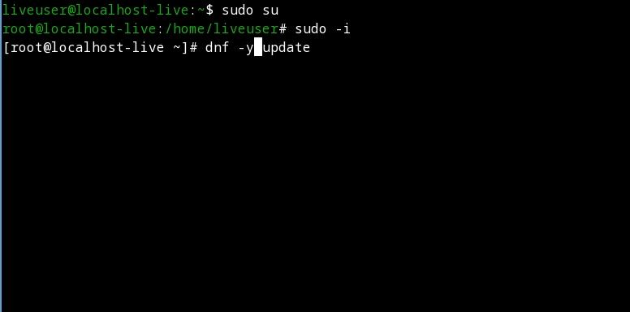
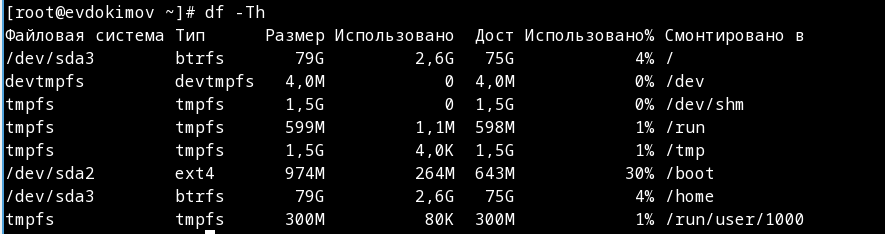

---
## Front matter
lang: ru-RU
title: "Лабораторная работа №1: Презентация."
subtitle: 
  Установка и настройка рабочей среды.
author: 
    Евдокимов Максим Михайлович. Группа - НФИбд-01-20.\inst{1}
institute: 
    \inst{1}Российский Университет Дружбы Народов

date: 22 декабря, 2023, Москва, Россия

## i18n babel
babel-lang: russian
babel-otherlangs: english

## Formatting pdf
toc: false
toc-title: Содержание
slide_level: 2
aspectratio: 169
section-titles: true
theme: metropolis
header-includes:
 - \metroset{progressbar=frametitle,sectionpage=progressbar,numbering=fraction}
 - '\makeatletter'
 - '\beamer@ignorenonframefalse'
 - '\makeatother'
---

# Цели и задачи работы

## Цель лабораторной работы

Целью данной работы является приобретение практических навыков установки операционной системы на виртуальную машину, настройки минимально необходимых для дальнейшей работы сервисов.

## Задание

1. Установка и настройка среды Fedora i3 на VirtualBox.
2. Подготовка среды и установка утилит для дальнейшего выполнение лабораторных.
3. Настройка имени пользователя и хоста.

# Указание к работе

- Лабораторная работа подразумевает установку на виртуальную машину VirtualBox (<https://www.virtualbox.org/>) операционной системы Linux (дистрибутив Fedora).
- Выполнение работы возможно как в дисплейном классе факультета физико-математических и естественных наук РУДН, так и дома. Описание выполнения работы приведено для дисплейного класса со следующими характеристиками техники:
- Intel Core i3-550 3.2 GHz, 4 GB оперативной памяти, 80 GB свободного места на жёстком диске;
- ОС Linux Gentoo (<http://www.gentoo.ru/>);
- VirtualBox версии 7.0 или новее.
- Для установки в виртуальную машину используется дистрибутив Linux Fedora (<https://getfedora.org>), вариант с менеджером окон i3 (<https://spins.fedoraproject.org/i3/>).
- При выполнении лабораторной работы на своей технике вам необходимо скачать необходимый образ операционной системы (<https://spins.fedoraproject.org/i3/download/index.html>).

## Создание виртуальной машины

1. Настройка хот-клавиши в VirlualBox c "right ctrl" на "right shift":

{#fig:001 width=70% height=70%}

---

2. Параметры системы:

Создайте новую виртуальную машину.
Укажите имя виртуальной машины (ваш логин в дисплейном классе), тип операционной системы — Linux, Fedora.
Укажите размер основной памяти виртуальной машины — от 2048 МБ.
Задайте конфигурацию жёсткого диска — загрузочный, VDI (VirtualBox Disk Image), динамический виртуальный диск.
Задайте размер диска — 80 ГБ (или больше), его расположение — в данном случае /var/tmp/имя_пользователя/fedora.vdi.
Выберите в VirtualBox Вашей виртуальной машины. Добавьте новый привод оптических дисков и выберите образ.
При установке на собственной технике используйте скачанный образ операционной системы Fedora.

---

{#fig:002 width=70% height=70%}

## Установка операционной системы

1. Запуск установщика:

{#fig:003 width=70% height=70%}

---

2. Указываем все данные:

Выберите язык интерфейса и перейдите к настройкам установки операционной системы.
При необходимости скорректируйте часовой пояс, раскладку клавиатуры (рекомендуется в качестве языка по умолчанию указать английский язык).
Место установки ОС оставьте без изменения.
Установите имя и пароль для пользователя root.
Установите имя и пароль для Вашего пользователя.
Задайте сетевое имя Вашего компьютера.
После завершения установки операционной системы корректно перезапустите виртуальную машину.
В VirtualBox оптический диск должен отключиться автоматически, но если это не произошло, то необходимо отключить носитель информации с образом.

---

{#fig:004 width=70% height=70%}

---

3. Завершение установки:

{#fig:005 width=70% height=70%}

## Установка драйверов для VirtualBox

1. Нажамаем комбинацию "Win+Enter" для запуска терминала. Переключим на роль супер-пользователя "sudo -i" и запуск проверки на обновление всех драйверов "dnf -y update":

{#fig:006 width=70% height=70%}

---

2. Устонавливаем Программы для удобства работы в консоли "dnf install tmux mc":

{#fig:007 width=70% height=70%}

---

3. Установка программного обеспечения для автоматического обновления (dnf install dnf-automatic) и Задаёте необходимую конфигурацию в файле "/etc/dnf/automatic.conf", запустим таймер "systemctl enable --now dnf-automatic.timer":

{#fig:008 width=70% height=70%}

---

4. В данном курсе мы не будем рассматривать работу с системой безопасности SELinux, поэтому отключим его; в файле "/etc/selinux/config" замените значение переменной SELINUX с enforcing на значение permissive (а также "sudo setenforce 0"), после чего перезапускаем виртуальную машину "reboot":

{#fig:009 width=70% height=70%}

---

5. Перед тем как выполнять следующий пункт мне пришлось изменить виртуальный привод на "VBoxLinuxAdditions":

{#fig:010 width=70% height=70%}

---

6. Теперь запустим терминальный мультиплексор "tmux", и сразу переключимся на супер-пользователя "sudo -i". После установите пакет DKMS "dnf -y install dkms", и в меню виртуальной машины подключите образ диска дополнений гостевой ОС. Подмонтируем диск "mount /dev/sr0 /media" проверив введя "mount" и устанавливаем драйвера (/media/VBoxLinuxAdditions.run), после чего перезапуск "reboot":

{#fig:011 width=70% height=70%}

## Настройка раскладки клавиатуры

Запустим терминальный мультиплексор tmux, и сразу переключимся на супер-пользователя "sudo -i". Отредактируем конфигурационный файл "/etc/X11/xorg.conf.d/00-keyboard.conf" чтобы он выглябил так:

```
Section "InputClass"
        Identifier "system-keyboard"
        MatchIsKeyboard "on"
        Option "XkbLayout" "us,ru"
        Option "XkbVariant" ",winkeys"
        Option "XkbOptions" "grp:rctrl_toggle,compose:ralt,terminate:ctrl_alt_bksp"
EndSection
```

---

{#fig:012 width=70% height=70%}

## Установка имени пользователя и названия хоста

Запустим терминальный мультиплексор tmux, и сразу переключимся на супер-пользователя (sudo -i). Создайте пользователя (вместо username укажите ваш логин в дисплейном классе) "adduser -G wheel username", задаём пароль для пользователя "passwd username" и установим имя хоста "hostnamectl set-hostname username".
Проверим, что имя хоста установлено верно "hostnamectl":

---

{#fig:013 width=70% height=70%}

# Домашнее задание

1. Дождитесь загрузки графического окружения и откройте терминал. В окне терминала проанализируйте последовательность загрузки системы, выполнив команду dmesg. Можно просто просмотреть вывод этой команды (dmesg | less).

2. Можно использовать поиск с помощью grep (dmesg | grep -i "то, что ищем").

{#fig:014 width=70% height=70%}

3. Получите следующую информацию.

- Версия ядра Linux (Linux version).

{#fig:015 width=70% height=70%}

---

- Частота процессора (Detected Mhz processor).

{#fig:016 width=70% height=70%}

---

- Модель процессора (CPU0).

{#fig:017 width=70% height=70%}

---

- Объём доступной оперативной памяти (Memory available).

{#fig:018 width=70% height=70%}

---

- Тип обнаруженного гипервизора (Hypervisor detected).

{#fig:019 width=70% height=70%}

---

- Тип файловой системы корневого раздела.

{#fig:020 width=70% height=70%}

---

- Последовательность монтирования файловых систем.

{#fig:021 width=70% height=70%}

# Контрольные вопросы

1. Какую информацию содержит учётная запись пользователя?

Информацию об учетных записях ОС Linux хранит в файле /etc/passwd. Он содержит следующее: Где: User ID - логин; Password – наличие пароля; UID - идентификатор пользователя; GID - идентификатор группы по умолчанию; User Info – вспомогательная информация о пользователе (полное имя, контакты и т.д.) Home Dir - начальный (он же домашний) каталог; Shell - регистрационная оболочка, или shell.

---

2. Укажите команды терминала и приведите примеры:

- для получения справки по команде: "help", "which", "whatis", "info", "apropos"

{#fig:022 width=70% height=70%}

---

- для перемещения по файловой системе: "cd", "ls", "pwd", "locate"

{#fig:023 width=70% height=70%}

---

- для просмотра содержимого каталога: "ls", "pwd"

{#fig:024 width=70% height=70%}

---

- для определения объёма каталога: "du"

{#fig:025 width=70% height=70%}

---

- для создания / удаления каталогов / файлов: "mkdir", "rm", "cat", "mv", "touch", "cp", "rm -R"

{#fig:026 width=70% height=70%}

---

- для задания определённых прав на файл / каталог: "chmod"

{#fig:027 width=70% height=70%}

---

- для просмотра истории команд: "history"

{#fig:028 width=70% height=70%}

---

3. Что такое файловая система? Приведите примеры с краткой характеристикой.

Представляет собой встроенный уровень операционной системы Linux, используемый для управления данными хранилища. Например виртуальная файловая система (VFS), это уровень абстракции поверх конкретной реализации файловой системы. Целью VFS является обеспечение единообразного доступа клиентских приложений к различным типам файловых систем.

---

4. Как посмотреть, какие файловые системы подмонтированы в ОС?

С помощь стандартной команды "df -Th"

{#fig:029 width=70% height=70%}

---

5. Как удалить зависший процесс?

Командой "kill" и её расщирениями которые позволяют на разном уровне и с разной интенсивностью убирать неугодные процессы. Есть варианты в виде "pkill" и "killall" с использованием "ping" для определение зависших процессов.

# Выводы по проделанной работе

## Вывод

В ходе выполнения лабораторной работы были установлены необходимые утилиты и драйвера, а также выполнены настройки для выполнения последующих работ. Также во время выполнения работы были повторены многие основополагающие принципы и навыки по работе с системой linux.
