---
## Front matter
lang: ru-RU
title: "Лабораторная работа №2: Презентация."
subtitle: 
  работа с git.
author: 
    Евдокимов Максим Михайлович. Группа - НФИбд-01-20.\inst{1}
institute: 
    \inst{1}Российский Университет Дружбы Народов

date: 23 декабря, 2023, Москва, Россия

## i18n babel
babel-lang: russian
babel-otherlangs: english

## Formatting pdf
toc: false
toc-title: Содержание
slide_level: 2
aspectratio: 169
section-titles: true
theme: metropolis
header-includes:
 - \metroset{progressbar=frametitle,sectionpage=progressbar,numbering=fraction}
 - '\makeatletter'
 - '\beamer@ignorenonframefalse'
 - '\makeatother'
---

# Цели и задачи работы

## Цель лабораторной работы

Изучить идеологию и применение средств контроля версий и освоить умения по работе с git.

## Задание

1. Создать базовую конфигурацию для работы с git.
2. Создать ключ SSH.
3. Создать ключ PGP.
4. Настроить подписи git.
5. Зарегистрироваться на Github.
6. Создать локальный каталог для выполнения заданий по предмету.

# Процесс выполнения лабораторной работы

## Установка программного обеспечения

Установим git командой "dnf install git" и Установка gh "dnf install gh" на нашу систему Fedora:

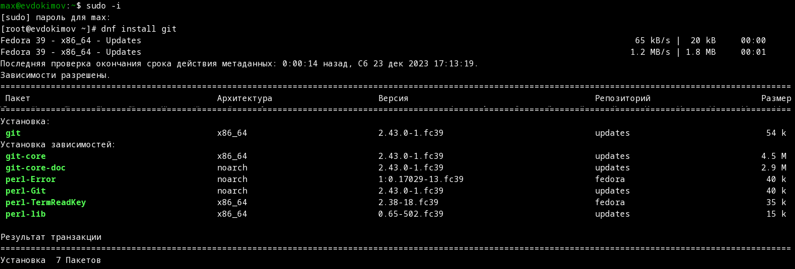{#fig:001 width=70% height=70%}

---

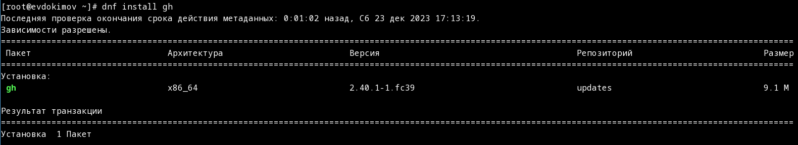{#fig:002 width=70% height=70%}

## Базовая настройка git

1. Зададим имя и email владельца репозитория используя команды "git config --global user.name "имя"" и "git config --global user.email "почта"", а также настроим utf-8 в выводе сообщений git "git config --global core.quotepath false":

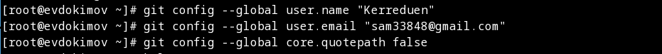{#fig:003 width=70% height=70%}

---

2. Настройте верификацию и подписание коммитов git (см. Верификация коммитов git с помощью GPG).

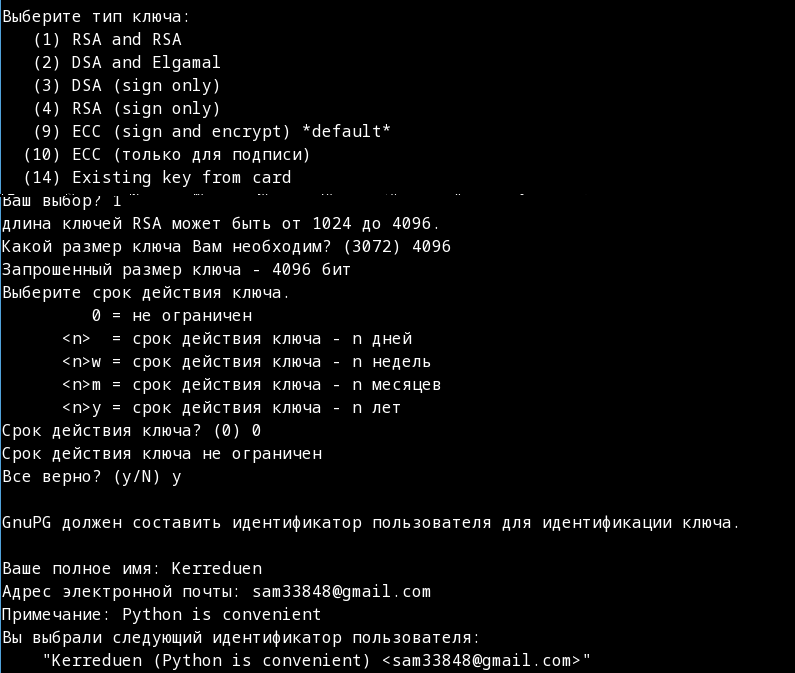{#fig:004 width=70% height=70%}

---

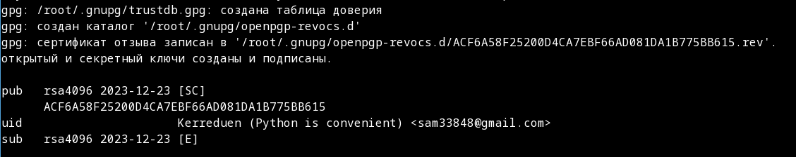{#fig:005 width=70% height=70%}

---

3. Зададим имя начальной ветки на master командой "git config --global init.defaultBranch master" и настроим другие параметры autocrlf - "git config --global core.autocrlf input" и safecrlf - "git config --global core.safecrlf warn"

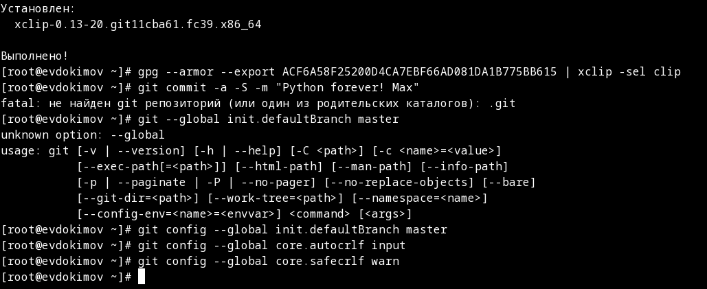{#fig:006 width=70% height=70%}

---

## Создайте ключи pgp

Генерируем ключ командой "gpg --full-generate-key" в опциях указываем такие значения: тип RSA and RSA; размер 4096; выберите срок действия; значение по умолчанию — 0 (срок действия не истекает никогда); указываем личную информацию которую запрашивает GPG, которая сохранится в ключе: Имя (не менее 5 символов) и Адрес электронной почты (соответструющий GitHub). В комментарий можно ввести что угодно или нажать клавишу ввода, чтобы оставить это поле пустым.

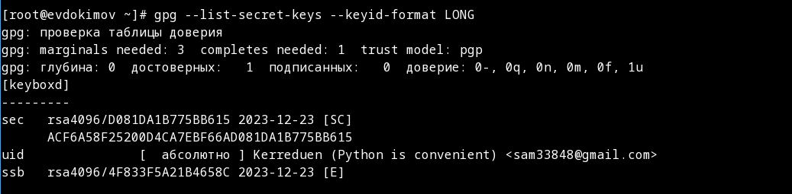{#fig:007 width=70% height=70%}

---

## Добавление PGP ключа в GitHub

Выводим список ключей и копируем отпечаток приватного ключа с помощью команды "gpg --list-secret-keys --keyid-format LONG" имеющий такой формат:

sec   Алгоритм/Отпечаток_ключа Дата_создания [Флаги] [Годен_до]
      ID_ключа
Cкопируйте ваш сгенерированный PGP ключ в буфер обмена:

После чего копируем ключ и вводим в github "gpg --armor --export ACF6A58F25200D4CA7EBF66AD081DA1B775BB615 | xclip -sel clip"

---

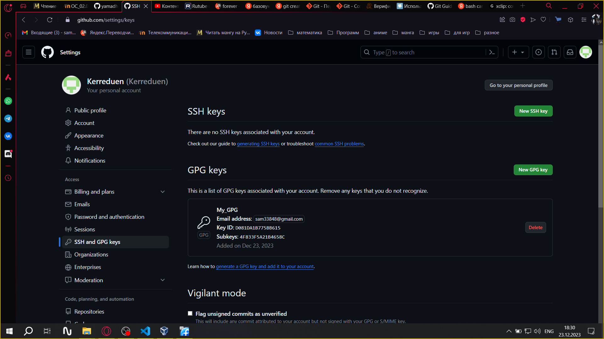{#fig:008 width=70% height=70%}

---

## Создайте ключи ssh

1. По алгоритму rsa с ключём размером 4096 бит испольуем команду "ssh-keygen -t rsa -b 4096" и следуем указанным инструкциям полуаем ssh-ключ:

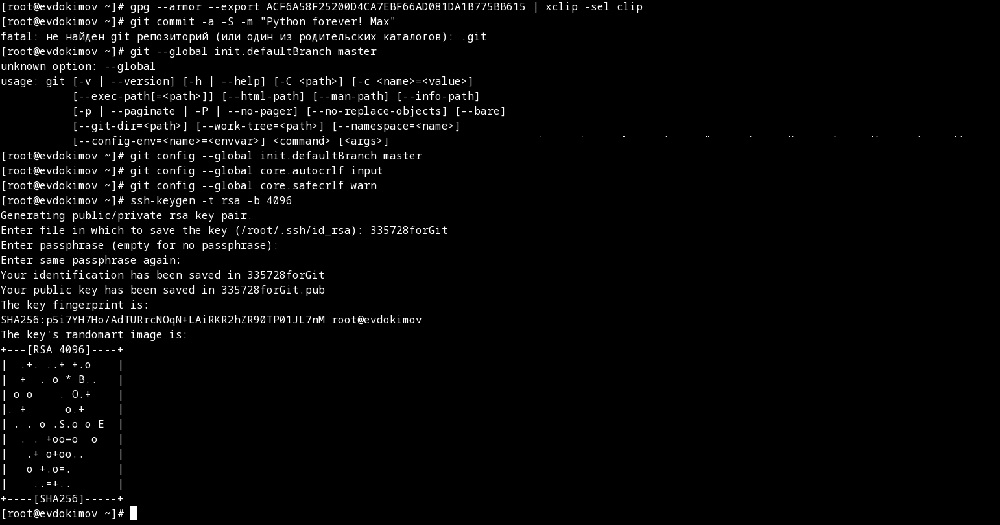{#fig:009 width=70% height=70%}

---

2. Повторяем генерацию, но по алгоритму ed25519 командой "ssh-keygen -t ed25519":

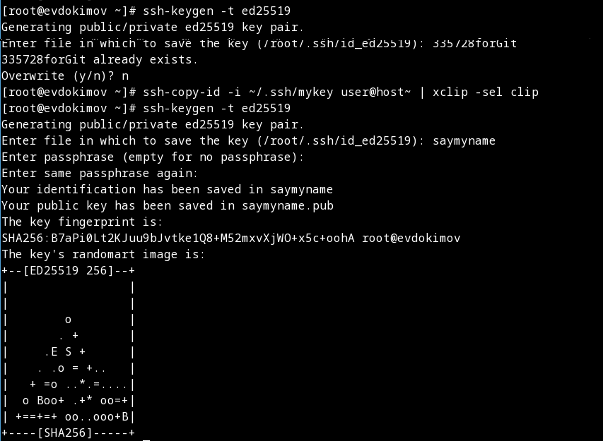{#fig:010 width=70% height=70%}

---

## Настройка автоматических подписей коммитов git и Настройка gh

1. Используя введёный email, укажите Git применять его при подписи коммитов:

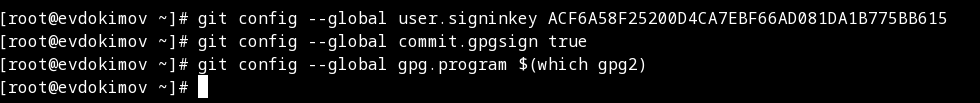{#fig:011 width=70% height=70%}

---

2. Для начала необходимо авторизоваться "gh auth login" Утилита задаст несколько наводящих вопросов на которые мы отвечаем, после чего я авторизоруюсь через броузер, так как в консоли не так удобно.

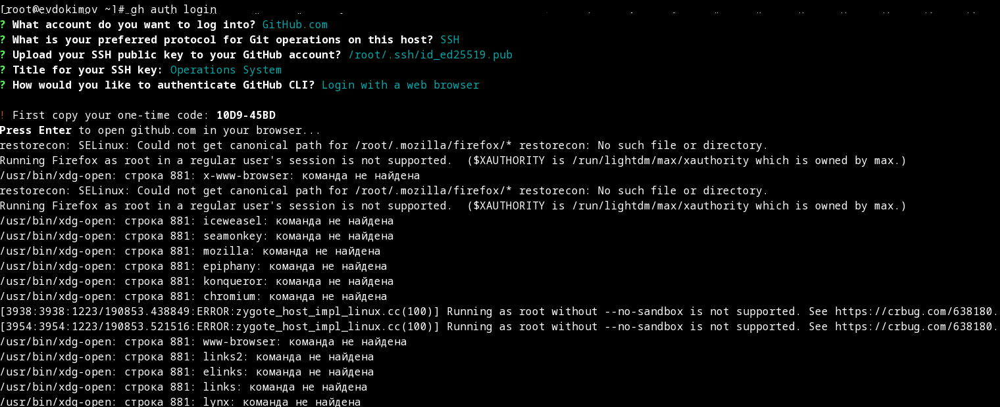{#fig:012 width=70% height=70%}

---

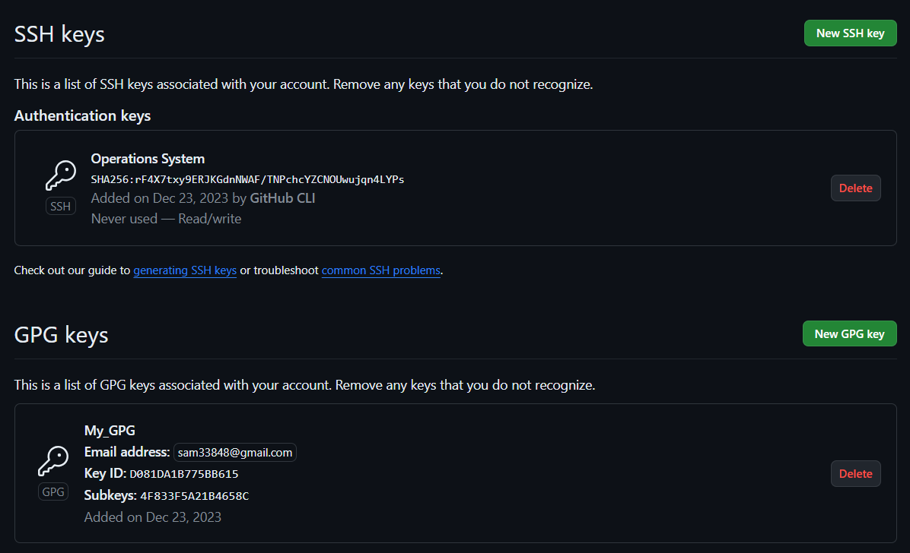{#fig:013 width=70% height=70%}

---

## Сознание репозитория курса на основе шаблона

Создаём шаблон рабочего пространства (см. Рабочее пространство для лабораторной работы) для 2022–2023 учебного года и предмета «Операционные системы» (код предмета os-intro) создание репозитория примет следующий вид (выполняем все команды):

```
mkdir -p ~/work/study/2022-2023/"Операционные системы"
cd ~/work/study/2022-2023/"Операционные системы"
gh repo create study_2022-2023_os-intro --template=yamadharma/course-directory-student-template --public
git clone --recursive git@github.com:<owner>/study_2022-2023_os-intro.git os-intro
```

---

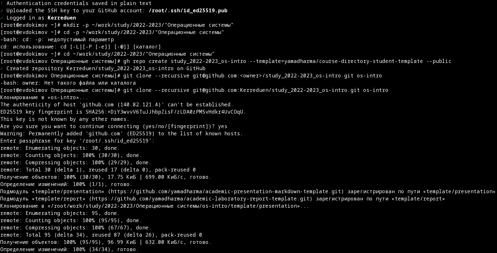{#fig:014 width=70% height=70%}

---

## Настройка каталога курса

Перейдя в каталог курса командой "cd ~/work/study/2022-2023/"Операционные системы"/os-intro" удаляем лишние файлы  командой "rm package.json" и Создаём необходимые каталоги "echo os-intro > COURSE" после применяем изменения "make", и отправляем файлы на сервер последовательность команд "git add .",  "git commit -am 'feat(main): make course structure'", "git push":

---

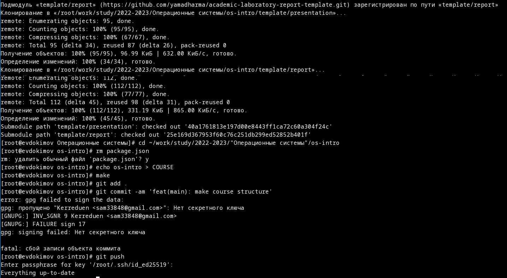{#fig:015 width=70% height=70%}

# Контрольные вопросы

1. Что такое системы контроля версий (VCS) и для решения каких задач они предназначаются?

Version Control System - созданно для совместной работы нескольких человек над одним проектом находящемся в локальном или удаленном репозитории.

---

2. Объясните следующие понятия VCS и их отношения: хранилище, commit, история, рабочая копия.

Хранилище - это особая система хранения данных которая после обновления данных сохранять предыдущие состояния файла или директории для просмотра изменений и возможгности возвращения к предыдущему состаянию.

Commit - это команда для индетификации изменений файлов, так он храним как и новое состояние так и все предыдущие сохронённые.

История - это система сохраняющая все внесенные в файл или ветвь изменения которая позволяет просмотреть кем и когда было совершено то или иное изменения, а также сохраняя общую историю изменений до точки ветвления версий.

Рабочая копия - это отдельно сохранённая в системе версия ветви или всего проекта и в зависимости от настроек которая не позволяет другим участникам вносить изменения в выбранный сегмент или версию.

---

3. Что представляют собой и чем отличаются централизованные и децентрализованные VCS? Приведите примеры VCS каждого вида.

Централизованный характеризуется тем что есть только один общий репозиторий (проект) в котором в зависимости од настроек и уровня прав каждый может внасить изменения и сруктура или файлы. Пример: Subversion и Perforce - Централизованные СКВ.
А детерминированный выражается в том что у каждого пользователя есть своя копия исходного репозитория которым они могут пользоватся независимо (даже офлайн) и после уже вносить изменения в серверный (исходный) из которого другие участники могут получить одновление своих локальных копий. Пример: RCS - локальное СКВ (1985).

---

4. Опишите действия с VCS при единоличной работе с хранилищем.

Когда пользователь является единоличным пользователем хранилища (владельцем например) он в целом самостоятельно регулировать процесс работы с ним, и всё что ему требуется это соблюдать общие правила и соблюдать базовые принципы работы с VCS: Получить нужную версию проекта (рабочую копию), внести в неё необходимые изменения, сделать нужный коммит, создав при этом новую версию проекта (старые не удаляются).

---

5. Опишите порядок работы с общим хранилищем VCS.

Он схож с единоличным за исключением некоторых отличий: нужно проверить и объединить внесённые разными пользователями изменения, отменить изменения или заблокировать некоторые файлы для изменения, обеспечив привилегированный доступ конкретному разработчику, предорительно обсудив или предупредив других пользователей.

---

6. Каковы основные задачи, решаемые инструментальным средством git?

Система контроля версий Git представляет собой набор программ командной строки. Доступ к ним можно получить из терминала посредством ввода команды git с различными опциями что позволяет нам избегать различные различные ошибки за счёт сохронения предыдущих версий, а также совместно работать над одним проектом не боясь испортить чужую работу посредствам создания новых ветвей и версии.

---

7. Назовите и дайте краткую характеристику командам git.

1)config - позволяет изменять базовые настройки git а так её взаимодействия с системой. 2)init - отвечает за создание новых репозиториев. 3)add - добовление указанных или всех файлов в актуальный репозиторий. 4)status - позволяет узнать и просмотреть статус репозитория. 5)commit - внесение изменений через однострочные сообщение или через редактор. 6)log - позволяет просмотривать историю коммита. 7)show - просмотр указанного коммита. 8)diff - просмотр не подготовленных для фиксации каммитов. 9)rm - удаление указанных файлов или ветвей. 10)mv - переименовывание файлов, ветвей. 11)checkout - отмена актуальных, последних или указанных изменений. 12)reset - востоновление подготовленных файлов. 13)commit --amend - измениние последнего каммита. 14)revert - откат последнего каммита. 15)branch - создание новой ветви. 16)merge - слияние ветвей. 17)remote - востоновление удалённого репозитория, файла, ветви. 18)push - отправка изменений в удаленный (общий) репозиторий. 19)pull - получение последних версии, изменений из удалённого репозитория. 20) rebase - переназначает словно изменяет каммиты с одной ветви на другую (копирует в новую директорию).

---

8. Приведите примеры использования при работе с локальным и удалённым репозиториями.

Допустим, нужно добавить в проект новый файл "file.txt". Если мы ратобаем с локальным репозиторием то достаточно Добавим файл в локальный репозиторий "git add file.txt" (файл лежит в том же каталоге, что и репозиторий) Сохранив изменения. Если с удалённым то загрузим нужную версию из репозитория "git checkout last" (last – имя нужной нам ветки) Добавим файл в локальный репозиторий: git add file.txt (файл лежит в том же каталоге, что и репозиторий) Сохраним изменения: git commit –am “file.txt was added” Отправим изменения в удалённый репозиторий: git push.

---

9. Что такое и зачем могут быть нужны ветви (branches)?

Ветка в Git — это набор коммитов, расположенных в хронологическом порядке. У каждой ветки есть свое название. Основная ветка чаще всего называется master, она появляется при инициализации репозитория и считается главной веткой проекта. Другим веткам вы даете имена самостоятельно. Дополнительные ветки используются для создания нового функционала и исправления ошибок. То есть ветви это "перестраховка" для того чтобы не изменять раньше времени или не вызывать конфликты с изменениями других в системе.

---

10. Как и зачем можно игнорировать некоторые файлы при commit?

Во время работы над проектом так или иначе могут создаваться файлы, которые не требуется добавлять впоследствии в репозиторий. Например, временные файлы, создаваемые редакторами, или объектные файлы, а также некоторые тестовые и личные данные.

# Выводы по проделанной работе

## Вывод

В ходе работы произведена установка и настройка всех необходимых программ и утилит для работы с git и github, в особенности по настрйке системы ssh и pgp.
