---
## Front matter
lang: ru-RU
title: "Лабораторная работа №4: Презентация."
subtitle: 
  Основы интерфейса взаимодействия пользователя с системой Unix на уровне командной строки.
author: 
    Евдокимов Максим Михайлович. Группа - НФИбд-01-20.\inst{1}
institute: 
    \inst{1}Российский Университет Дружбы Народов

date: 7 октября, 2023, Москва, Россия

## i18n babel
babel-lang: russian
babel-otherlangs: english

## Formatting pdf
toc: false
toc-title: Содержание
slide_level: 2
aspectratio: 169
section-titles: true
theme: metropolis
header-includes:
 - \metroset{progressbar=frametitle,sectionpage=progressbar,numbering=fraction}
 - '\makeatletter'
 - '\beamer@ignorenonframefalse'
 - '\makeatother'
---

# Цели и задачи работы

## Цель лабораторной работы

Приобретение практических навыков взаимодействия пользователя с системой посредством командной строки.

## Задание

1. Приобредение базовых навыков по работе с unix системой.
2. Приобредение навыков по созданию удалению и просмотру директорий.
3. Получение знаний по работе с командой man и history.

# Указание к работе

## Описание метода

Формат команды. Командой в операционной системе называется записанный по специальным правилам текст (возможно с аргументами), представляющий собой указание на выполнение какой-либо функций (или действий) в операционной системе. Обычно первым словом идёт имя команды, остальной текст — аргументы или опции, конкретизирующие действие. Общий формат команд можно представить следующим образом: *<имя_команды><разделитель><аргументы>*

---

**Команда man**. Команда man используется для просмотра (оперативная помощь) в диалоговом режиме руководства (manual) по основным командам операционной системы типа Linux

**Команда cd**. Команда cd используется для перемещения по файловой системе операционной системы типа Linux.

**Команда pwd**. Для определения абсолютного пути к текущему каталогу используется команда pwd (print working directory).

**Команда ls**. Команда ls используется для просмотра содержимого каталога.

---

**Команда mkdir**. Команда mkdir используется для создания каталогов.

**Команда rm**. Команда rm используется для удаления файлов и/или каталогов.

**Команда history**. Для вывода на экран списка ранее выполненных команд используется команда history. Выводимые на экран команды в списке нумеруются. К любой команде из выведенного на экран списка можно обратиться по её номеру в списке, воспользовавшись конструкцией !<номер_команды>.

# Процесс выполнения лабораторной работы

1. Определите полное имя вашего домашнего каталога. Далее относительно этого каталога будут выполняться последующие упражнения.

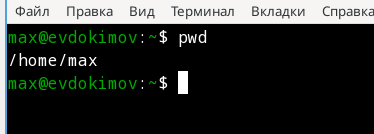{#fig:001 width=70% height=70%}

---

2. Выполните следующие действия:

2.1. Перейдите в каталог /tmp.

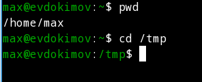{#fig:002 width=70% height=70%}

---

2.2. Выведите на экран содержимое каталога /tmp. Для этого используйте команду ls с различными опциями. Поясните разницу в выводимой на экран информации.

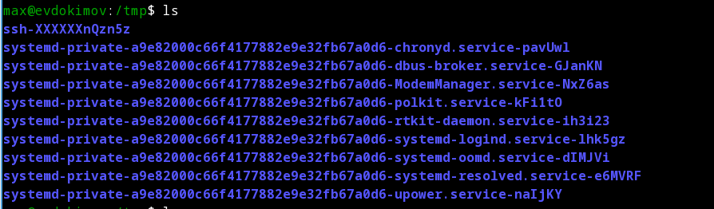{#fig:003 width=70% height=70%}

---

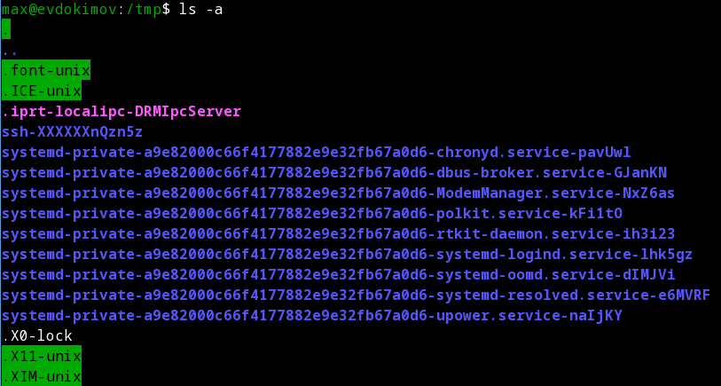{#fig:004 width=70% height=70%}

---

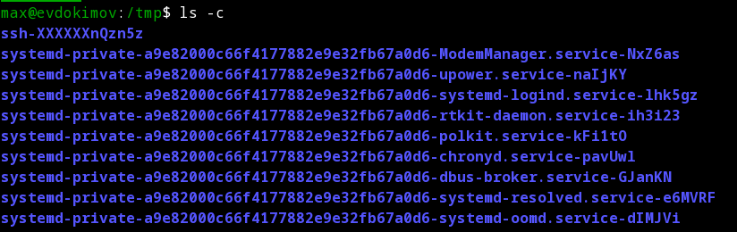{#fig:005 width=70% height=70%}

---

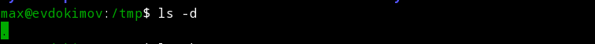{#fig:006 width=70% height=70%}

---

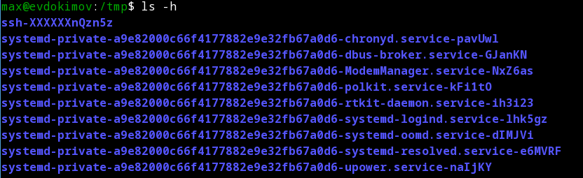{#fig:007 width=70% height=70%}

---

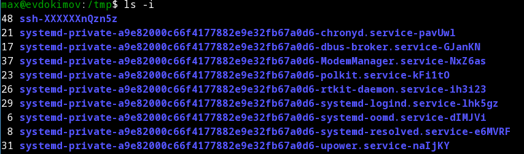{#fig:008 width=70% height=70%}

---

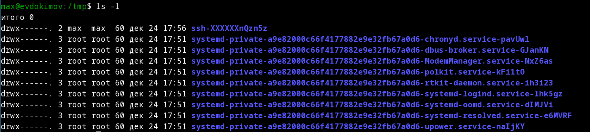{#fig:009 width=70% height=70%}

---

2.3. Определите, есть ли в каталоге /var/spool подкаталог с именем cron?

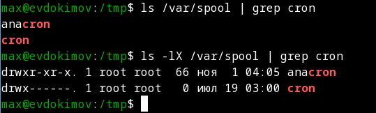{#fig:010 width=70% height=70%}

---

2.4. Перейдите в Ваш домашний каталог и выведите на экран его содержимое. Определите, кто является владельцем файлов и подкаталогов?

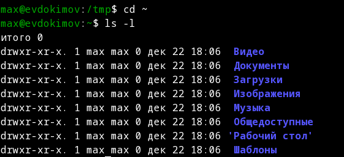{#fig:011 width=70% height=70%}

---

3. Выполните следующие действия:

3.1. В домашнем каталоге создайте новый каталог с именем newdir.

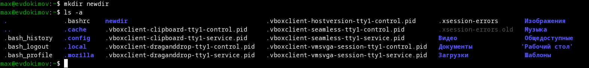{#fig:012 width=70% height=70%}

---

3.2. В каталоге ~/newdir создайте новый каталог с именем morefun.

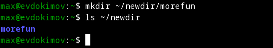{#fig:013 width=70% height=70%}

---

3.3. В домашнем каталоге создайте одной командой три новых каталога с именами letters, memos, misk. Затем удалите эти каталоги одной командой.

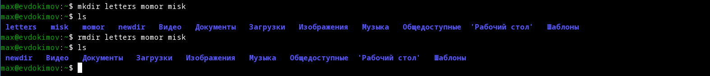{#fig:014 width=70% height=70%}

---

3.4. Попробуйте удалить ранее созданный каталог ~/newdir командой rm. Проверьте, был ли каталог удалён.

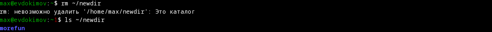{#fig:015 width=70% height=70%}

---

3.5. Удалите каталог ~/newdir/morefun из домашнего каталога. Проверьте, был ли каталог удалён.

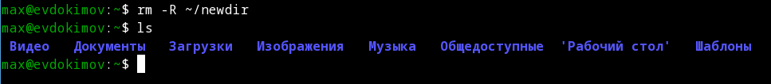{#fig:016 width=70% height=70%}

---

4. С помощью команды man определите, какую опцию команды ls нужно использовать для просмотра содержимое не только указанного каталога, но и подкаталогов,
входящих в него.

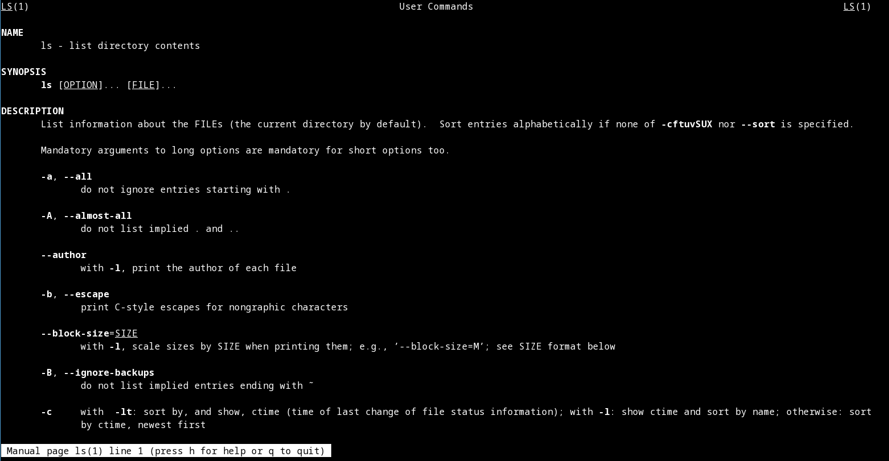{#fig:017 width=70% height=70%}

---

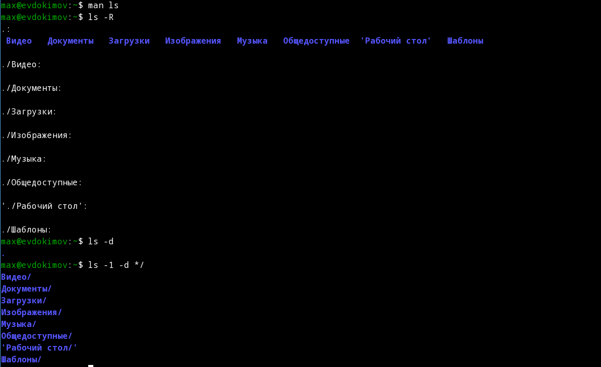{#fig:018 width=70% height=70%}

---

5. С помощью команды man определите набор опций команды ls, позволяющий отсортировать по времени последнего изменения выводимый список содержимого каталога
с развёрнутым описанием файлов.

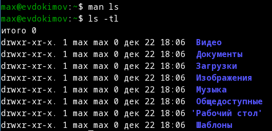{#fig:019 width=70% height=70%}

---

6. Используйте команду man для просмотра описания следующих команд: cd, pwd, mkdir, rmdir, rm. Поясните основные опции этих команд.

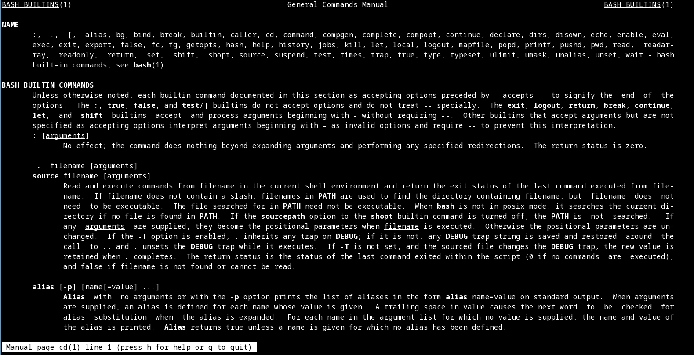{#fig:020 width=70% height=70%}

---

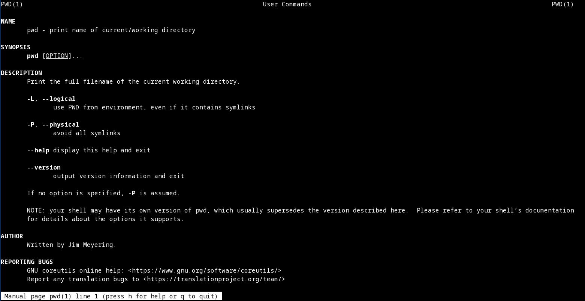{#fig:021 width=70% height=70%}

---

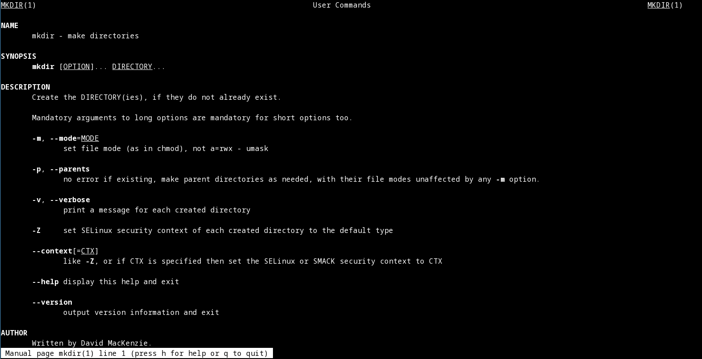{#fig:022 width=70% height=70%}

---

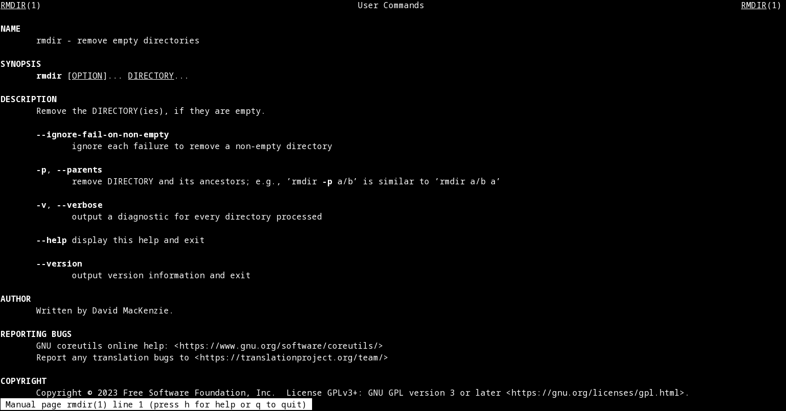{#fig:023 width=70% height=70%}

---

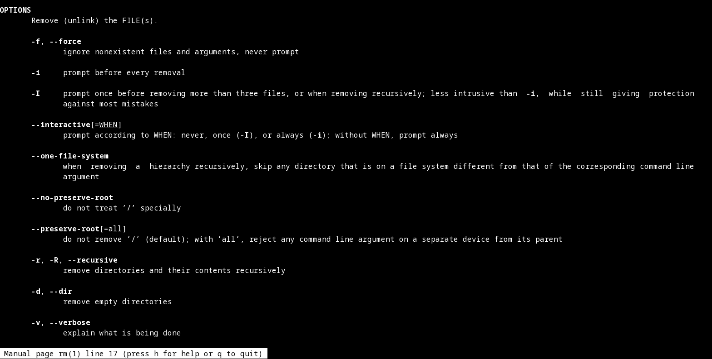{#fig:024 width=70% height=70%}

---

7. Используя информацию, полученную при помощи команды history, выполните модификацию и исполнение нескольких команд из буфера команд.

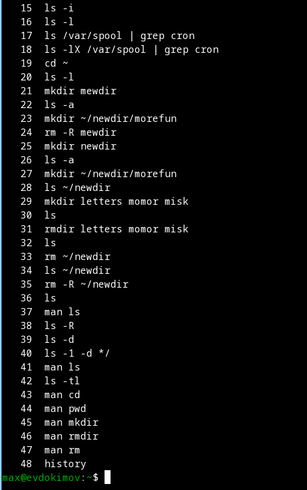{#fig:025 width=70% height=70%}

---

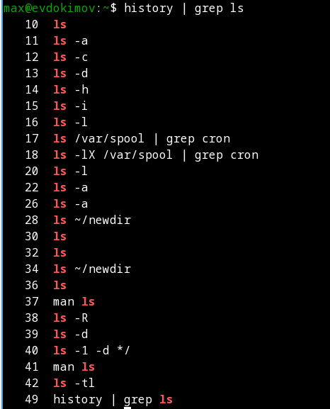{#fig:026 width=70% height=70%}

---

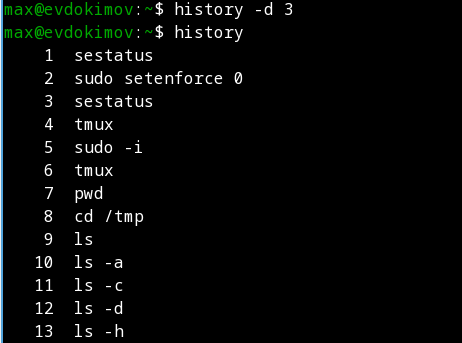{#fig:027 width=70% height=70%}

---

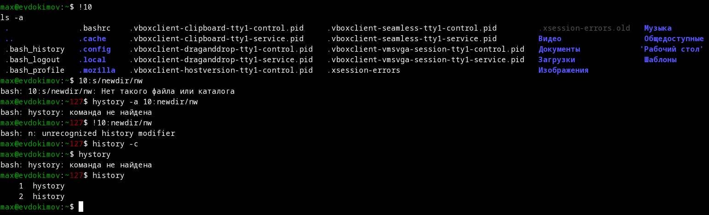{#fig:028 width=70% height=70%}

---

# Контрольные вопросы

1. Что такое командная строка?

Это текстовый интерфейс, который позволяет вводить команды, выполнять их и просматривать результаты. Вы можете запустить терминал (текстовый экран внутри графического рабочего стола или текстовую консоль вне любого графического интерфейса) и интерпретатор команд внутри него (оболочка).

---

2. При помощи какой команды можно определить абсолютный путь текущего каталога? Приведите пример.

Для этого можно использовать команду "pwd"

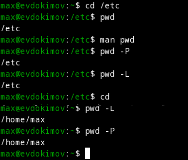{#fig:029 width=70% height=70%}

---

3. При помощи какой команды и каких опций можно определить только тип файлов и их имена в текущем каталоге? Приведите примеры.

Для этого может подойти команда "ls -F".

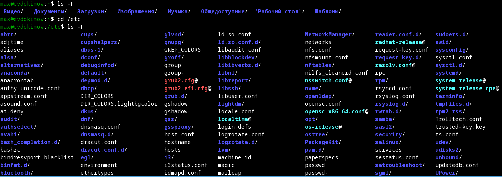{#fig:030 width=70% height=70%}

---

4. Каким образом отобразить информацию о скрытых файлах? Приведите примеры.

С помощью команды "ls -a":

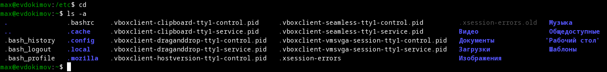{#fig:031 width=70% height=70%}

---

5. При помощи каких команд можно удалить файл и каталог? Можно ли это сделать одной и той же командой? Приведите примеры.

Это можно сделать 2 способами "rm -r" и "rmdir":

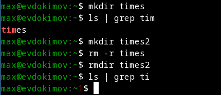{#fig:032 width=70% height=70%}

---

6. Каким образом можно вывести информацию о последних выполненных пользователем командах? работы?

Для этого достаточно команды "history" и её атрибутов и функций.

---

7. Как воспользоваться историей команд для их модифицированного выполнения? Приведите примеры.

Для этого можно воспользоватся особыми операторами "!" для выделение конкретного элемента истории и после через ":" с атрибутом s указать через слешь что заменить на что:

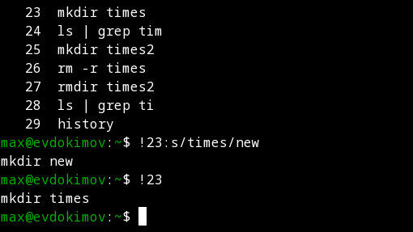{#fig:033 width=70% height=70%}

---

8. Приведите примеры запуска нескольких команд в одной строке.

Для этого можно использовать оператор ";":

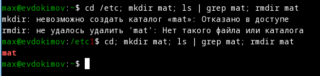{#fig:034 width=70% height=70%}

---

9. Дайте определение и приведите примера символов экранирования.

Это особые символы которые имеют определенный функционал и никак иначе их не вызвать. Экранированные символы предворяются косой чертой "\" за которой следует сам символ, например: `, ``, t, n, \ и т.д.

---

10. Охарактеризуйте вывод информации на экран после выполнения команды ls с опцией l.

"ls -l" - это команда для вывода подробной информации об файлах в системе, при этом о каждом файле и каталоге будет выведена следующая информация: тип файла, право доступа, число ссылок, владелец, размер, дата последней ревизии, имя файла или каталога.

---

11. Что такое относительный путь к файлу? Приведите примеры использования относительного и абсолютного пути при выполнении какой-либо команды.

Относительный путь - это ссылка, указывающая, на другие каталоги, относительно каталога, в котором мы находимся. Допустим, я сейчас нахожусь в каталоге etc/sets, который содержит каталог images. Тогда, чтобы перейти в каталог images мне достаточно написать команду "cd images", в ином случае придётся писать полный (абсолютный) путь например "cd /home/tsganina/etc/sets/images".

---

12. Как получить информацию об интересующей вас команде?

Чтобы получить информацию об интересующей меня команде есть два пути: команда help или команда man.

---

13. Какая клавиша или комбинация клавиш служит для автоматического дополнения вводимых команд?

В системе unix при стандартных настройках достаточно нажать клавишу "Tab".

# Выводы по проделанной работе

## Вывод

В ходе выполнения работы были изучены основные команды и методы по работе с интерфейсом пользователя с системой Unix.
