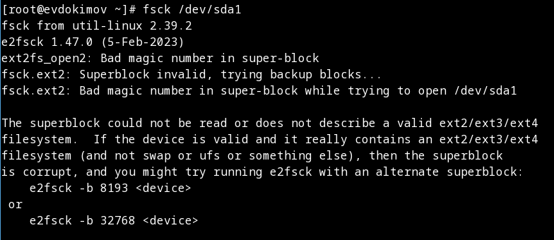
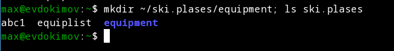
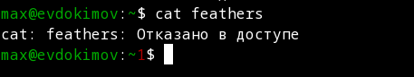

---
## Front matter
lang: ru-RU
title: "Лабораторная работа №5: отчет."
subtitle: "Анализ файловой системы Linux. Команды для работы с файлами и каталогами."
author: "Евдокимов Максим Михайлович. Группа - НФИбд-01-20."

## Generic otions
lang: ru-RU
toc-title: "Содержание"

## Bibliography
bibliography: bib/cite.bib
csl: pandoc/csl/gost-r-7-0-5-2008-numeric.csl

## Pdf output format
toc: true # Table of contents
toc-depth: 2
lof: true # List of figures
fontsize: 12pt
linestretch: 1.5
papersize: a4
documentclass: scrreprt
## I18n polyglossia
polyglossia-lang:
  name: russian
  options:
	- spelling=modern
	- babelshorthands=true
polyglossia-otherlangs:
  name: english
## I18n babel
babel-lang: russian
babel-otherlangs: english
## Fonts
mainfont: PT Serif
romanfont: PT Serif
sansfont: PT Sans
monofont: PT Mono
mainfontoptions: Ligatures=TeX
romanfontoptions: Ligatures=TeX
sansfontoptions: Ligatures=TeX,Scale=MatchLowercase
monofontoptions: Scale=MatchLowercase,Scale=0.9
## Biblatex
biblatex: true
biblio-style: "gost-numeric"
biblatexoptions:
  - parentracker=true
  - backend=biber
  - hyperref=auto
  - language=auto
  - autolang=other*
  - citestyle=gost-numeric
## Pandoc-crossref LaTeX customization
figureTitle: "Рис."
listingTitle: "Листинг"
lofTitle: "Список иллюстраций"
lotTitle: "Список таблиц"
lolTitle: "Листинги"
## Misc options
indent: true
header-includes:
  - \usepackage{indentfirst}
  - \usepackage{float} # keep figures where there are in the text
  - \floatplacement{figure}{H} # keep figures where there are in the text
---

# Цель работы

Ознакомление с файловой системой Linux, её структурой, именами и содержанием каталогов. Приобретение практических навыков по применению команд для работы с файлами и каталогами, по управлению процессами (и работами), по проверке использования диска и обслуживанию файловой системы.

# Задание

1. Работа с файловой системой и методы её определения и создания.
2. Настройка и работа с уровнями доступа к файлам и директориям.
3. Перемещение, удалеение и переназначение файлов и директорий.

# Указание к работе

## Описание метода

Для создания текстового файла можно использовать команду "touch".

Для просмотра файлов небольшого размера можно использовать команду "cat".

Для просмотра файлов постранично удобнее использовать команду "less".

Команда "head" выводит по умолчанию первые 10 строк файла или указанное количество n.

Команда "tail" выводит умолчанию 10 последних строк файла или указанное количество n.

Команда "cp" используется для копирования файлов и каталогов.

Команды "mv" и "mvdir" предназначены для перемещения и переименования файлов и каталогов.

Права доступа к файлу или каталогу можно изменить, воспользовавшись командой "chmod". Сделать это может владелец файла (или каталога) или пользователь с правами администратора.

Для просмотра используемых в операционной системе файловых систем можно воспользоваться командой "mount" без параметров.

Другой способ определения смонтированных в операционной системе файловых систем — просмотр файла/etc/fstab. Сделать это можно например с помощью команды "cat".

Для определения объёма свободного пространства на файловой системе можно воспользоваться командой "df", которая выведет на экран список всех файловых систем в соответствии с именами устройств, с указанием размера и точки монтирования.

С помощью команды "fsck" можно проверить (а в ряде случаев восстановить) целостность файловой системы.

# Выполнение лабораторной работы

## Условие задания

1. Выполните все примеры, приведённые в первой части описания лабораторной работы.

{#fig:001 width=70% height=70%}

{#fig:002 width=70% height=70%}

{#fig:003 width=70% height=70%}

{#fig:004 width=70% height=70%}

{#fig:005 width=70% height=70%}

{#fig:006 width=70% height=70%}

{#fig:007 width=70% height=70%}

{#fig:008 width=70% height=70%}

{#fig:009 width=70% height=70%}

{#fig:010 width=70% height=70%}

{#fig:011 width=70% height=70%}

{#fig:012 width=70% height=70%}

2. Выполните следующие действия, зафиксировав в отчёте по лабораторной работе используемые при этом команды и результаты их выполнения:

2.1. Скопируйте файл /usr/include/sys/io.h в домашний каталог и назовите его equipment. Если файла io.h нет, то используйте любой другой файл в каталоге /usr/include/sys/ вместо него.

{#fig:013 width=70% height=70%}

2.2. В домашнем каталоге создайте директорию ~/ski.plases.

{#fig:014 width=70% height=70%}

2.3. Переместите файл equipment в каталог ~/ski.plases.

{#fig:015 width=70% height=70%}

2.4. Переименуйте файл ~/ski.plases/equipment в ~/ski.plases/equiplist.

{#fig:016 width=70% height=70%}

2.5. Создайте в домашнем каталоге файл abc1 и скопируйте его в каталог ~/ski.plases, назовите его equiplist2.

{#fig:017 width=70% height=70%}

2.6. Создайте каталог с именем equipment в каталоге ~/ski.plases.

{#fig:018 width=70% height=70%}

2.7. Переместите файлы ~/ski.plases/equiplist и equiplist2 в каталог ~/ski.plases/equipment.

{#fig:019 width=70% height=70%}

2.8. Создайте и переместите каталог ~/newdir в каталог ~/ski.plases и назовите его plans.

{#fig:020 width=70% height=70%}

3. Определите опции команды chmod, необходимые для того, чтобы присвоить перечисленным ниже файлам выделенные права доступа, считая, что в начале таких прав нет (При необходимости создайте нужные файлы):
3.1. drwxr--r-- ... australia
3.2. drwx--x--x ... play
3.3. -r-xr--r-- ... my_os
3.4. -rw-rw-r-- ... feathers

{#fig:021 width=70% height=70%}

{#fig:022 width=70% height=70%}

4. Проделайте приведённые ниже упражнения, записывая в отчёт по лабораторной работе используемые при этом команды:

4.1. Просмотрите содержимое файла /etc/password.

{#fig:023 width=70% height=70%}

4.2. Скопируйте файл ~/feathers в файл ~/file.old.

{#fig:024 width=70% height=70%}

4.3. Переместите файл ~/file.old в каталог ~/play.

{#fig:025 width=70% height=70%}

4.4. Скопируйте каталог ~/play в каталог ~/fun.

{#fig:026 width=70% height=70%}

4.5. Переместите каталог ~/fun в каталог ~/play и назовите его games.

{#fig:027 width=70% height=70%}

4.6. Лишите владельца файла ~/feathers права на чтение.

{#fig:028 width=70% height=70%}

4.7. Что произойдёт, если вы попытаетесь просмотреть файл ~/feathers командой cat?

{#fig:029 width=70% height=70%}

4.8. Что произойдёт, если вы попытаетесь скопировать файл ~/feathers?

{#fig:030 width=70% height=70%}

4.9. Дайте владельцу файла ~/feathers право на чтение.

{#fig:031 width=70% height=70%}

4.10. Лишите владельца каталога ~/play права на выполнение.

{#fig:032 width=70% height=70%}

4.11. Перейдите в каталог ~/play. Что произошло?

{#fig:033 width=70% height=70%}

4.12. Дайте владельцу каталога ~/play право на выполнение.

{#fig:034 width=70% height=70%}

5. Прочитайте man по командам mount, fsck, mkfs, kill и кратко их охарактеризуйте, приведя примеры.

{#fig:035 width=70% height=70%}

{#fig:036 width=70% height=70%}

{#fig:037 width=70% height=70%}

{#fig:038 width=70% height=70%}

# Контрольные вопросы

1. Дайте характеристику каждой файловой системе, существующей на жёстком диске компьютера, на котором вы выполняли лабораторную работу.

{#fig:039 width=70% height=70%}

- proc. Файловая система proc является важным источником информации о вашей Linux-системе, который попросту нельзя игнорировать. Вообще, proc является псевдо- или виртуальной файловой системой, которая предоставляет пользователям доступ к внутренним структурам ядра Linux. Другими словами, proc не является реальной файловой системой в обычном смысле; она располагается исключительно в оперативной памяти, а не на диске. При этом она автоматически монтируется системой.
- Sysfs - отправляет данные в пространство пользователя с помощью виртуальных файлов. Эти данные содержат данные о различных подсистемах ядра, аппаратных устройствах и связанных с ними драйверах устройств.
- tmpfs и devtmpfs - они относятся к энергозависимой памяти.
- devpts - обеспечивает доступ к терминалам pseudo (PTY).
- cgroup2 - Неверно ведущий себя процесс может создавать тонны процессов через ветвления, запуская некую бомбу ветвлений и сокрушая своё ядро. Это означает, что нам требуется ввести некий способ контроля ресурсов для процессов в пределах заданного пространства имён. Это достигается через механизм, носящий название групп контроля (control groups), обычно именуемых cgroups. cgroups работают под понятием контроллеров cgroup и представляются в файловой системе с названием cgroupfs в самом ядре Linux. В настоящее время применяется cgroup v2 версия cgroups.
- pstore - был введен в Linux для записи информации (например, dmesg tail) при выключении. Pstore не зависит от kdump и может запускаться до него. В определенных сценариях (например, хосты/гости с корневыми файловыми системами на NFS/iSCSI, где произошел сбой сетевого программного и/или аппаратного обеспечения), pstore может содержать информацию, доступную для посмертной отладки, которая не может быть получена иным образом.
- bpf - это псевдо-файловая система, существующая только в памяти, которая позволяет создавать файлы, ссылающиеся на объекты BPF.
- btrfs - файловая система для Linux, основанная на структурах B-деревьев и работающая по принципу «копирование при записи» (copy-on-write). Опубликована корпорацией Oracle в 2007 году под лицензией GNU General Public License.
- selinux - Как и файловая система /proc, /selinux является псевдофайловой системой. Новая реализация SE Linux использует расширенные атрибуты для хранения контекста безопасности.
- tracefs - файловая система для задач трассировки Linux
- debugfs - DebugFS является самой известной утилитой, предназначенной для работы с файловыми системами EXT2FS и EXT3FS.
- hugetlb - использует страницы большого размера, что позволяет кэшировать больше адресов за раз.
- mqueue - обеспечивает необходимую поддержку ядра для библиотеки пользовательского пространства, которая реализует интерфейсы очереди сообщений POSIX.
- fusectl - это простой интерфейс для программ пользовательского пространства для экспорта виртуальной файловой системы в ядро Linux.
- configf - Виртуальная файловая система, представляющая состояние ядра операционной системы и запущенных процессов в виде файлов.
- ext4 - журналируемая файловая система, используемая преимущественно в операционных системах с ядром Linux, созданная на базе ext3 в 2006 году.
- fuse.gv, fuse.po, fuse.je - FUSE (файловая система в пользовательском пространстве) — это интерфейс для программ пользовательского пространства для экспорта файловой системы в ядро Linux.

2. Приведите общую структуру файловой системы и дайте характеристику каждой директории первого уровня этой структуры.

Верхний уровень / => root каталог, содержит в себе всю иерархию системы и от него идут все остольные:

/bin — здесь находятся двоичные исполняемые файлы. Основные общие команды, хранящиеся отдельно от других программ в системе (прим.: pwd, ls, cat, ps);
/boot — тут расположены файлы, используемые для загрузки системы (образ initrd, ядро vmlinuz);
/dev — в данной директории располагаются файлы устройств (драйверов). С помощью этих файлов можно взаимодействовать с устройствами. К примеру, если это жесткий диск, можно подключить его к файловой системе. В файл принтера же можно написать напрямую и отправить задание на печать;
/etc— в этой директории находятся файлы конфигураций программ. Эти файлы позволяют настраивать системы, сервисы, скрипты системных демонов;
/home — каталог, аналогичный каталогу Users в Windows. Содержит домашние каталоги учетных записей пользователей (кроме root). При создании нового пользователя здесь создается одноименный каталог с аналогичным именем и хранит личные файлы этого пользователя;
/lib — содержит системные библиотеки, с которыми работают программы и модули ядра;
/lost+found — содержит файлы, восстановленные после сбоя работы системы. Система проведет проверку после сбоя и найденные файлы можно будет посмотреть в данном каталоге;
/media — точка монтирования внешних носителей. Например, когда вы вставляете диск в дисковод, он будет автоматически смонтирован в директорию /media/cdrom;
/mnt — точка временного монтирования. Файловые системы подключаемых устройств обычно монтируются в этот каталог для временного использования;
/opt — тут расположены дополнительные (необязательные) приложения. Такие программы обычно не подчиняются принятой иерархии и хранят свои файлы в одном подкаталоге (бинарные, библиотеки, конфигурации);
/proc — содержит файлы, хранящие информацию о запущенных процессах и о состоянии ядра ОС;
/root — директория, которая содержит файлы и личные настройки суперпользователя;
/run — содержит файлы состояния приложений. Например, PID-файлы или UNIX-сокеты;
/sbin — аналогично /bin содержит бинарные файлы. Утилиты нужны для настройки и администрирования системы суперпользователем;
/srv — содержит файлы сервисов, предоставляемых сервером (прим. FTP или Apache HTTP);
/sys — содержит данные непосредственно о системе. Тут можно узнать информацию о ядре, драйверах и устройствах;
/tmp — содержит временные файлы. Данные файлы доступны всем пользователям на чтение и запись. Стоит отметить, что данный каталог очищается при перезагрузке;
/usr — содержит пользовательские приложения и утилиты второго уровня,
используемые пользователями, а не системой. Содержимое доступно только для чтения (кроме root). Каталог имеет вторичную иерархию и похож на корневой;
/var — содержит переменные файлы. Имеет подкаталоги, отвечающие за отдельные переменные. Например, логи будут храниться в /var/log, кэш в /var/cache, очереди заданий в /var/spool/ и так далее.

3. Какая операция должна быть выполнена, чтобы содержимое некоторой файловой системы было доступно операционной системе?

Команда mount то есть монтирование тома (монтирование дисков).

4. Назовите основные причины нарушения целостности файловой системы. Как устранить повреждения файловой системы?

Отсутствие синхронизации между образом файловой системы в памяти и ее данными на диске в случае аварийного останова может привести к появлению следующих ошибок:

- Один блок адресуется несколькими mode (принадлежит нескольким файлам).
- Блок помечен как свободный, но в то же время занят (на него ссылается onode).
- Блок помечен как занятый, но в то же время свободен (ни один inode на него не ссылается).
- Неправильное число ссылок в inode (недостаток или избыток ссылающихся записей в каталогах).
- Несовпадение между размером файла и суммарным размером адресуемых inode блоков.
- Недопустимые адресуемые блоки (например, расположенные за пределами файловой системы).
- "Потерянные" файлы (правильные inode, на которые не ссылаются записи каталогов).
- Недопустимые или неразмещенные номера inode в записях каталогов.

5. Как создаётся файловая система?

mkfs - позволяет создать файловую систему Linux, семейства ext: "sudo mkfs -t тип устройство".

6. Дайте характеристику командам для просмотра текстовых файлов.

- cat <имя_файла> - Это самая простая и, пожалуй, самая популярная команда для просмотра файла в Linux. Cat просто печатает содержимое файла на стандартном экране,т.е. на экране. В основном используется для небольших файлов.
- Less <имя_файла>. Команда Less просматривает файл по одной странице за раз.
- Head <имя_файла>. Команда Head — это еще один способ просмотра текстового файла, но с небольшой разницей. Команда head отображает первые 10 строк текстового файла по умолчанию. Вы можете изменить это поведение, используя опции с командой head, но основной принцип остается тем же: команда head начинает работать с заголовка (начала) файла.
- Tail <имя_файла>. Команда Tail в Linux аналогична и все же противоположна команде head. В то время как команда head отображает файл с начала, команда tail отображает файл с конца. По умолчанию команда tail отображает последние 10 строк файла. Команды Head и Tail могут быть объединены для отображения выбранных строк из файла. Вы также можете использовать команду tail для просмотра изменений, внесенных в файл в режиме реального времени.

7. Приведите основные возможности команды cp в Linux.

Это сокращение от copy, и она делает именно то, что предполагает ее название: она копирует, также используется для копирования файлов из одного местоположения в другое,  используется для копирования всех каталогов в новое место или для копирования нескольких файлов и каталогов.

8. Приведите основные возможности команды mv в Linux.

Команда mv используется для перемещения файлов из одного каталога в другой. Также команда mv используется для переименования файла в системах Linux.

9. Что такое права доступа? Как они могут быть изменены? При ответах на вопросы используйте дополнительные источники информации по теме.

Права доступа определяют, какие действия конкретный пользователь может или не может совершать с определенным файлами и каталогами. Каждый файл можно изменять по трём параметра доступа:

- Чтение - разрешает получать содержимое файла. Для каталога позволяет получить список файлов и каталогов, расположенных в нем;
- Запись - разрешает записывать новые данные в файл или изменять существующие, а также позволяет создавать и изменять файлы и каталоги;
- Выполнение - разрешает запускать программу, если у нее есть флаг выполнения. Этот атрибут устанавливается для всех программ и скриптов, именно с помощью него система может понять, что этот файл является запускаемым.

Для изменение этих данных (разделённых на 3 типа пользователей u - user, g - group, o - others) используется команда chmod.

# Выводы

В ходе выполнения лабораторной работы были изучены файловые системы linux а также повторены основы работы с файлами и котологами и их уровнями доступа.

# Список литературы {.unnumbered}

1. [Лабораторной работе №5](https://esystem.rudn.ru/mod/resource/view.php?id=970826)
2. [Информация о файловой системе](https://selectel.ru/blog/directory-structure-linux/)
3. [Подсказки для контрольных](https://studfile.net/preview/16459303/page:3/)
