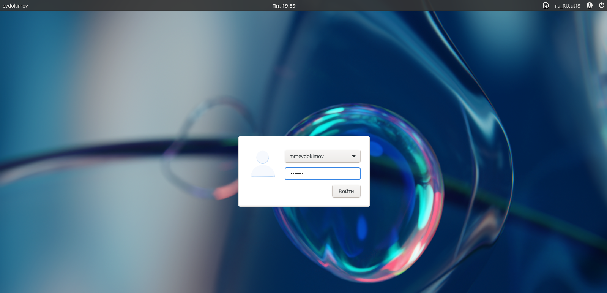
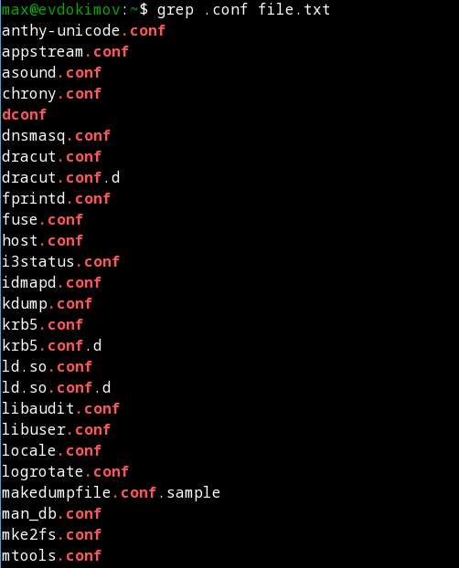

---
## Front matter
lang: ru-RU
title: "Лабораторная работа №6: отчет."
subtitle: "Поиск файлов. Перенаправление ввода-вывода. Просмотр запущенных процессов."
author: "Евдокимов Максим Михайлович. Группа - НФИбд-01-20."

## Generic otions
lang: ru-RU
toc-title: "Содержание"

## Bibliography
bibliography: bib/cite.bib
csl: pandoc/csl/gost-r-7-0-5-2008-numeric.csl

## Pdf output format
toc: true # Table of contents
toc-depth: 2
lof: true # List of figures
fontsize: 12pt
linestretch: 1.5
papersize: a4
documentclass: scrreprt
## I18n polyglossia
polyglossia-lang:
  name: russian
  options:
	- spelling=modern
	- babelshorthands=true
polyglossia-otherlangs:
  name: english
## I18n babel
babel-lang: russian
babel-otherlangs: english
## Fonts
mainfont: PT Serif
romanfont: PT Serif
sansfont: PT Sans
monofont: PT Mono
mainfontoptions: Ligatures=TeX
romanfontoptions: Ligatures=TeX
sansfontoptions: Ligatures=TeX,Scale=MatchLowercase
monofontoptions: Scale=MatchLowercase,Scale=0.9
## Biblatex
biblatex: true
biblio-style: "gost-numeric"
biblatexoptions:
  - parentracker=true
  - backend=biber
  - hyperref=auto
  - language=auto
  - autolang=other*
  - citestyle=gost-numeric
## Pandoc-crossref LaTeX customization
figureTitle: "Рис."
listingTitle: "Листинг"
lofTitle: "Список иллюстраций"
lotTitle: "Список таблиц"
lolTitle: "Листинги"
## Misc options
indent: true
header-includes:
  - \usepackage{indentfirst}
  - \usepackage{float} # keep figures where there are in the text
  - \floatplacement{figure}{H} # keep figures where there are in the text
---

# Цель работы

Ознакомление с инструментами поиска файлов и фильтрации текстовых данных. Приобретение практических навыков: по управлению процессами (и заданиями), по проверке использования диска и обслуживанию файловых систем.

# Задание

1. Изучить основы работы с процессами на базовом уровне.
2. Научиться работать с методами поиска и фильтрации данных.
3. Научится работать с запись данных и проверкой диска и обслуживанием файловой системы.

# Указание к работе

## Описание метода

Конвейер (pipe) служит для объединения простых команд или утилит в цепочки, в которых результат работы предыдущей команды передаётся последующей (action1 | action2).

Конвейеры можно группировать в цепочки и выводить с помощью перенаправления в файл, например "ls -la |sort > sortilg_list".

Большинство используемых в консоли команд и программ записывают результаты своей работы в стандартный поток вывода stdout. Например, команда ls выводит в стандартный поток вывода (консоль) список файлов в текущей директории. Потоки вывода и ввода можно перенаправлять на другие файлы или устройства. Проще всего это делается с помощью символов >, >>, <, <<. Рассмотрим пример.

Команда find используется для поиска и отображения на экран имён файлов, соответствующих заданной строке символов. Путь определяет каталог, начиная с которого по всем подкаталогам будет вестись поиск.

# Выполнение лабораторной работы

## Запись и вывод с файла

1. Осуществите вход в систему, используя соответствующее имя пользователя.

{#fig:001 width=70% height=70%}

2. Запишите в файл file.txt названия файлов, содержащихся в каталоге /etc. Допишите в этот же файл названия файлов, содержащихся в вашем домашнем каталоге.

{#fig:002 width=70% height=70%}

{#fig:003 width=70% height=70%}

3. Выведите имена всех файлов из file.txt, имеющих расширение .conf, после чего запишите их в новый текстовой файл conf.txt.

{#fig:004 width=70% height=70%}

{#fig:005 width=70% height=70%}

## Система поиска и фильтрации

4. Определите, какие файлы в вашем домашнем каталоге имеют имена, начинавшиеся с символа c? Предложите несколько вариантов, как это сделать.

{#fig:006 width=70% height=70%}

5. Выведите на экран (по странично) имена файлов из каталога /etc, начинающиеся с символа h.

{#fig:007 width=70% height=70%}

6. Запустите в фоновом режиме процесс, который будет записывать в файл ~/logfile файлы, имена которых начинаются с log.

{#fig:008 width=70% height=70%}

7. Удалите файл ~/logfile

{#fig:009 width=70% height=70%}

## Работа с процессами

8. Запустите из консоли в фоновом режиме редактор gedit.

{#fig:010 width=70% height=70%}

9. Определите идентификатор процесса gedit, используя команду ps, конвейер и фильтр grep. Как ещё можно определить идентификатор процесса?

{#fig:011 width=70% height=70%}

10. Прочтите справку (man) команды kill, после чего используйте её для завершения процесса gedit.

{#fig:012 width=70% height=70%}

{#fig:013 width=70% height=70%}

11. Выполните команды df и du, предварительно получив более подробную информацию об этих командах, с помощью команды man.

{#fig:014 width=70% height=70%}

{#fig:015 width=70% height=70%}

{#fig:016 width=70% height=70%}

12. Воспользовавшись справкой команды find, выведите имена всех директорий, имеющихся в вашем домашнем каталоге.

{#fig:017 width=70% height=70%}

{#fig:018 width=70% height=70%}

# Контрольные вопросы

1. Какие потоки ввода вывода вы знаете?

– stdin - стандартный поток ввода (по умолчанию: клавиатура), файловый дескриптор 0;
– stdout - стандартный поток вывода (по умолчанию: консоль), файловый дескриптор 1;
– stderr - стандартный поток вывод сообщений об ошибках (по умолчанию: консоль), файловый дескриптор 2.

2. Объясните разницу между операцией > и >>.

\>filename - Перенаправление вывода (stdout) в файл “filename”.
\>>filename - Перенаправление вывода (stdout) в файл “filename”, файл открывается в режиме добавления.

3. Что такое конвейер?

Конвейер (pipe) служит для объединения простых команд или утилит в цепочки, в которых результат работы предыдущей команды передаётся последующей. (команда1 | команда2)

4. Что такое процесс? Чем это понятие отличается от программы?

Компьютерная программа сама по себе — лишь пассивная последовательность инструкций. В то время как процесс — непосредственное выполнение этих инструкций.

5. Что такое PID и GID?

Идентификатор процесса (PID). Каждому новому процессу ядро присваивает уникальный идентификационный номер. В любой момент времени идентификатор процесса является уникальным, хотя после завершения процесса он может использоваться снова для другого процесса. Некоторые идентификаторы зарезервированы системой для особых процессов. Так, процесс с идентификатором 1 - это процесс инициализации init, являющийся предком всех других процессов в системе.
Идентификатор группы GID и эффективный идентификатор группы (EGID) GID - это идентификационный номер группы данного процесса. EGID связан с GID также, как EUID с UID.

6. Что такое задачи и какая команда позволяет ими управлять?

Задачи - это то, что мы подаем на выполнение системе, какой-то процесс, который она начинает выполнять, чтобы проследить за ними можно использовать Команду "jobs".

7. Найдите информацию об утилитах top и htop. Каковы их функции?

top (table of processes) — консольная команда, которая выводит список работающих в системе процессов и информацию о них. По умолчанию она в реальном времени сортирует их по нагрузке на процессор. Программа написана для UNIXсовместимых операционных систем и опубликована под свободной лицензией GNU FDL.
htop — продвинутый монитор процессов, написанный для Linux. Он был задуман заменить стандартную программу top. Htop показывает динамический список системных процессов, список обычно выравнивается по использованию ЦПУ. В отличие от top, htop показывает все процессы в системе. Также показывает время непрерывной работы, использование процессоров и памяти. Htop часто применяется в тех случаях, когда информации даваемой утилитой top недостаточно, например при поиске утечек памяти в процессах. Htop написан на языке Си и использует для отображения библиотеку Ncurses.

8. Назовите и дайте характеристику команде поиска файлов. Приведите примеры использования этой команды.

Команда find используется для поиска и отображения на экран имён файлов, соответствующих заданной строке символов. Формат команды: "find <путь> <-опции>",пример: "find /etc -name "p*" -print".

9. Можно ли по контексту (содержанию) найти файл? Если да, то как?

Для поиска файла по содержимому проще всего воспользоваться командой "grep", пример: "grep -r строка_поиска каталог".

10. Как определить объем свободной памяти на жёстком диске?

При помощи команды df (аббревиатура от disk free) — утилита в UNIX и UNIX-подобных системах, показывает список всех файловых систем по именам устройств, сообщает их размер, занятое и свободное пространство и точки монтирования.

11. Как определить объем вашего домашнего каталога?

Для этого есть команда "du -a ~".

12. Как удалить зависший процесс?

Для завершения процесса нужно вызвать утилиту kill с параметром "-9" или с параметром "ping".

# Выводы

В ходе выполнения лабораторной работы были изучены и применены на практике базовые команды по работе с процессами, а также с методами и командами поиска и по файловой системе и записи данных в файлы.

# Список литературы {.unnumbered}

1. [Лабораторная работа №6](https://esystem.rudn.ru/mod/resource/view.php?id=970828)
2. [Информация по работе с процессами в Linux](https://losst.pro/upravlenie-protsessami-v-linux)
3. [Советы и рекомендации по использованию Linux pipes](https://habr.com/ru/articles/195152/)
