---
## Front matter
lang: ru-RU
title: "Лабораторная работа №7: отчет."
subtitle: "Командная оболочка Midnight Commander."
author: "Евдокимов Максим Михайлович. Группа - НФИбд-01-20."

## Generic otions
lang: ru-RU
toc-title: "Содержание"

## Bibliography
bibliography: bib/cite.bib
csl: pandoc/csl/gost-r-7-0-5-2008-numeric.csl

## Pdf output format
toc: true # Table of contents
toc-depth: 2
lof: true # List of figures
fontsize: 12pt
linestretch: 1.5
papersize: a4
documentclass: scrreprt
## I18n polyglossia
polyglossia-lang:
  name: russian
  options:
	- spelling=modern
	- babelshorthands=true
polyglossia-otherlangs:
  name: english
## I18n babel
babel-lang: russian
babel-otherlangs: english
## Fonts
mainfont: PT Serif
romanfont: PT Serif
sansfont: PT Sans
monofont: PT Mono
mainfontoptions: Ligatures=TeX
romanfontoptions: Ligatures=TeX
sansfontoptions: Ligatures=TeX,Scale=MatchLowercase
monofontoptions: Scale=MatchLowercase,Scale=0.9
## Biblatex
biblatex: true
biblio-style: "gost-numeric"
biblatexoptions:
  - parentracker=true
  - backend=biber
  - hyperref=auto
  - language=auto
  - autolang=other*
  - citestyle=gost-numeric
## Pandoc-crossref LaTeX customization
figureTitle: "Рис."
listingTitle: "Листинг"
lofTitle: "Список иллюстраций"
lotTitle: "Список таблиц"
lolTitle: "Листинги"
## Misc options
indent: true
header-includes:
  - \usepackage{indentfirst}
  - \usepackage{float} # keep figures where there are in the text
  - \floatplacement{figure}{H} # keep figures where there are in the text
---

# Цель работы

Освоение основных возможностей командной оболочки Midnight Commander. Приобретение навыков практической работы по просмотру каталогов и файлов; манипуляций
с ними.

# Задание

1. Научиться работать с файловой системой в mc.
2. Научиться настраивать и управлять системой mc.
3. Научиться работать в внутреннем редакторе.

# Указание к работе

## Описание метода

*Командная оболочка* — интерфейс взаимодействия пользователя с операционной системой и программным обеспечением посредством команд.

*Midnight Commander* (или mc) — псевдографическая командная оболочка для UNIX/Linux систем. Для запуска mc необходимо в командной строке набрать mc и нажать "Enter". Рабочее пространство mc имеет две панели, отображающие по умолчанию списки файлов двух каталогов.

Встроенный в *mc редактор* вызывается с помощью функциональной клавиши "F4". В нём удобно использовать различные комбинации клавиш при редактировании содержимого (как правило текстового) файла.

# Выполнение лабораторной работы

## ЧАСТЬ 1

1. Изучите информацию о mc, вызвав в командной строке man mc.

{#fig:001 width=70% height=70%}

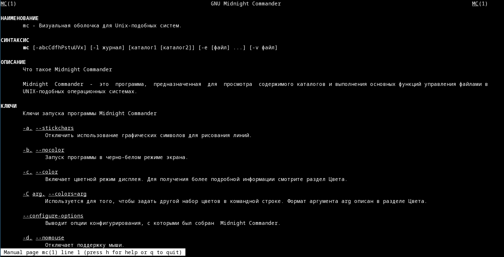{#fig:002 width=70% height=70%}

2. Запустите из командной строки mc, изучите его структуру и меню.

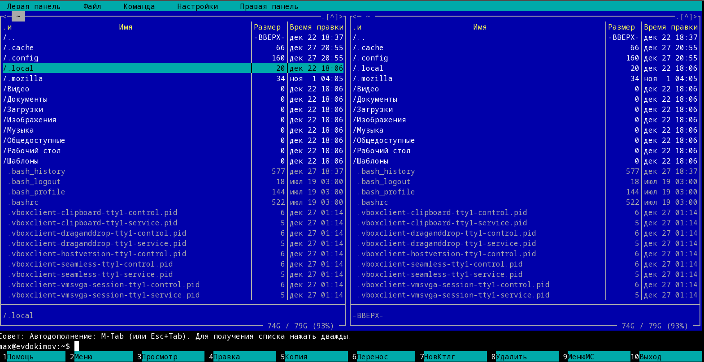{#fig:003 width=70% height=70%}

3. Выполните несколько операций в mc, используя управляющие клавиши (операции с панелями; выделение/отмена выделения файлов, копирование/перемещение файлов, получение информации о размере и правах доступа на файлы и/или каталоги и т.п.)

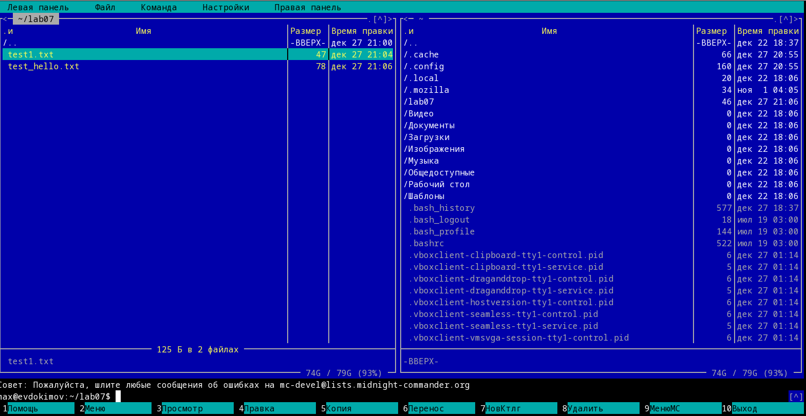{#fig:004 width=70% height=70%}

4. Выполните основные команды меню левой (или правой) панели. Оцените степень подробности вывода информации о файлах.

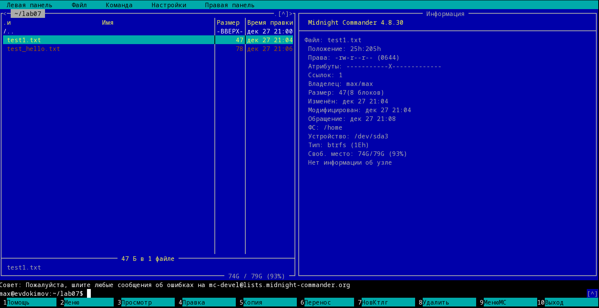{#fig:007 width=70% height=70%}

5. Используя возможности подменю Файл, выполните:

5.1 просмотр содержимого текстового файла;

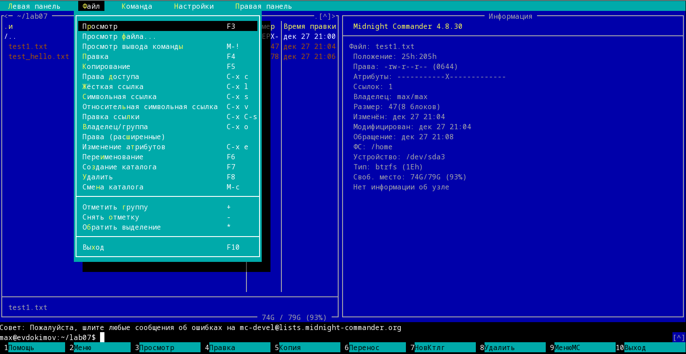{#fig:008 width=70% height=70%}

5.2 редактирование содержимого текстового файла (без сохранения результатов редактирования);

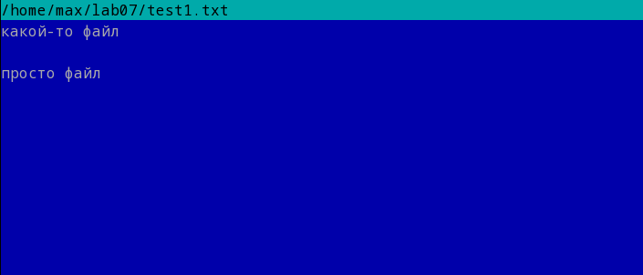{#fig:009 width=70% height=70%}

5.3 создание каталога;

{#fig:006 width=70% height=70%}

5.4 копирование в файлов в созданный каталог.

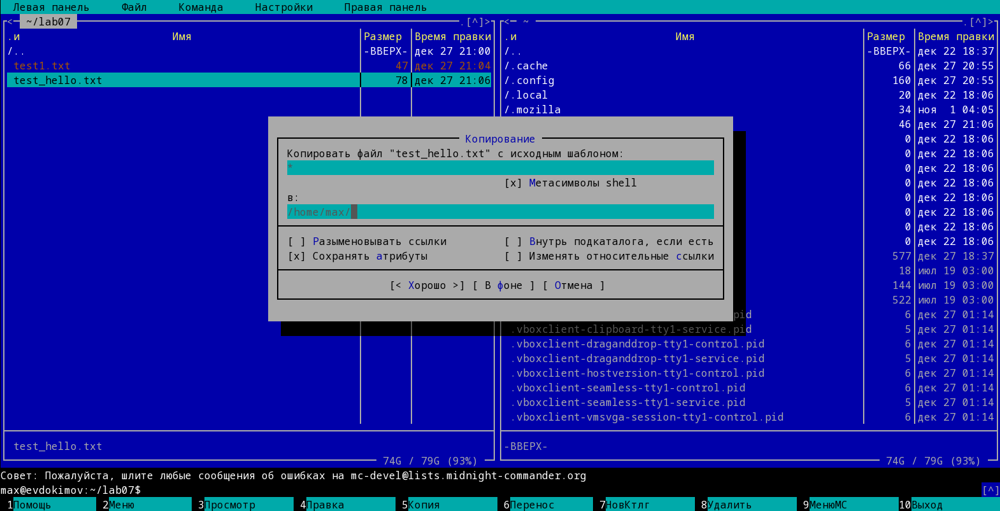{#fig:005 width=70% height=70%}

6. С помощью соответствующих средств подменю Команда осуществите:

6.1 поиск в файловой системе файла с заданными условиями (например, файла с расширением .c или .cpp, содержащего строку main);

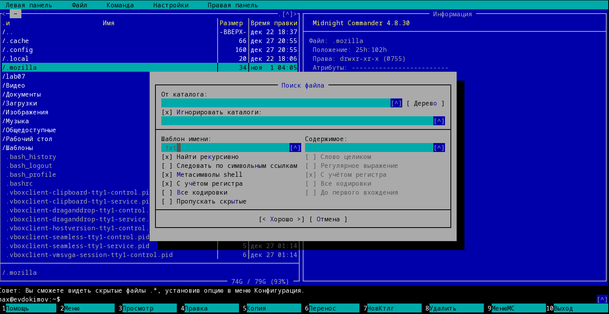{#fig:010 width=70% height=70%}

6.2 выбор и повторение одной из предыдущих команд;

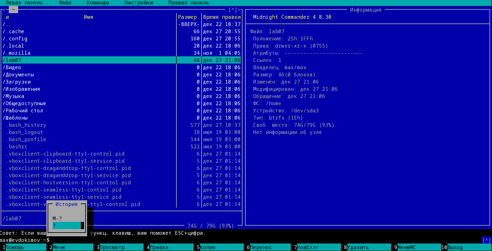{#fig:011 width=70% height=70%}

6.3 переход в домашний каталог;

6.4 анализ файла меню и файла расширений.

Сделано как и предыдущее задание в рамках выполнения предыдущих заданий.

7. Вызовите подменю Настройки. Освойте операции, определяющие структуру экрана mc (Full screen, Double Width, Show Hidden Files и т.д.):

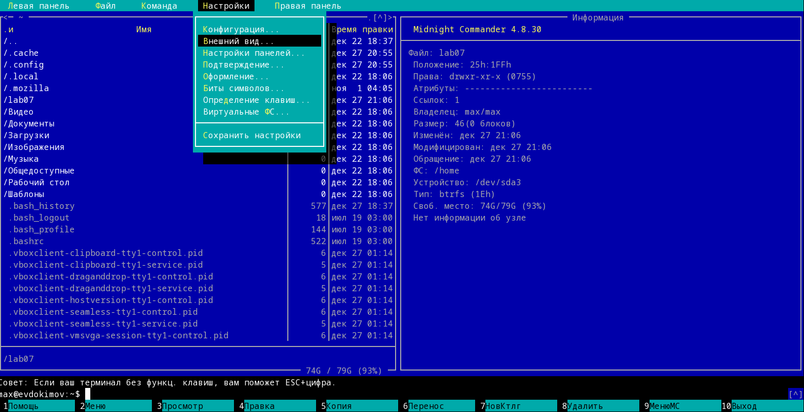{#fig:012 width=70% height=70%}

## ЧАСТЬ 2

1. Создайте текстовой файл text.txt.

{#fig:013 width=70% height=70%}

2. Откройте этот файл с помощью встроенного в mc редактора.

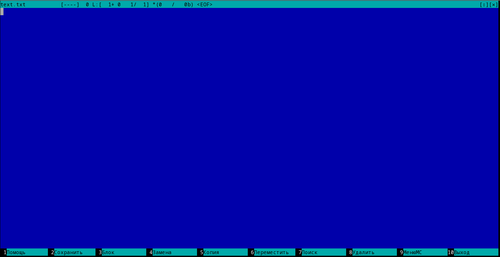{#fig:014 width=70% height=70%}

3. Вставьте в открытый файл небольшой фрагмент текста, скопированный из любого другого файла или Интернета.

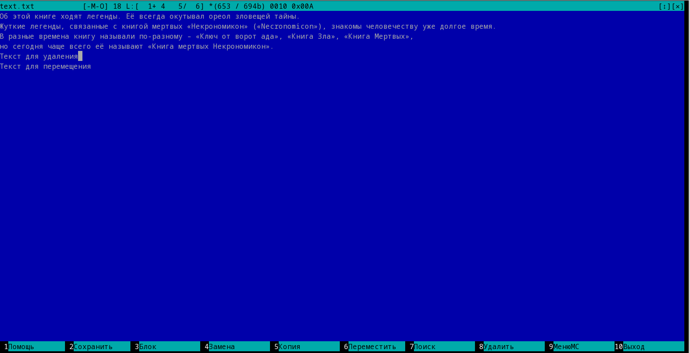{#fig:015 width=70% height=70%}

4. Проделайте с текстом следующие манипуляции, используя горячие клавиши:

4.1. Удалите строку текста.

{#fig:016 width=70% height=70%}

4.2. Выделите фрагмент текста и скопируйте его на новую строку.

{#fig:017 width=70% height=70%}

4.3. Выделите фрагмент текста и перенесите его на новую строку.

{#fig:018 width=70% height=70%}

4.4. Сохраните файл.

{#fig:019 width=70% height=70%}

4.5. Отмените последнее действие.

{#fig:020 width=70% height=70%}

4.6. Перейдите в конец файла (нажав комбинацию клавиш) и напишите некоторый текст.

{#fig:021 width=70% height=70%}

4.7. Перейдите в начало файла (нажав комбинацию клавиш) и напишите некоторый текст.

{#fig:022 width=70% height=70%}

4.8. Сохраните и закройте файл.

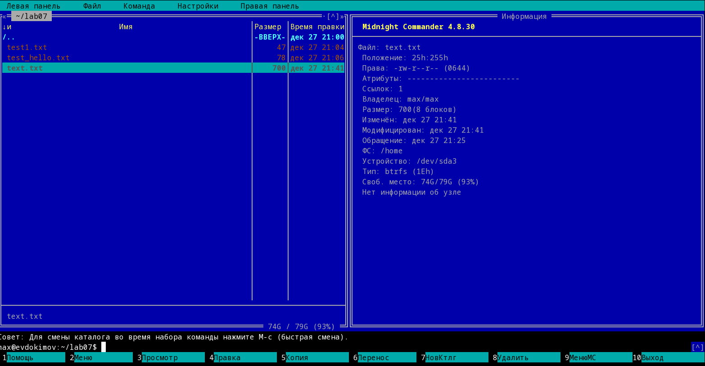{#fig:023 width=70% height=70%}

5. Откройте файл с исходным текстом на некотором языке программирования (например C или Java).

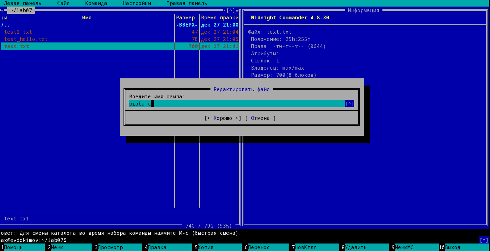{#fig:024 width=70% height=70%}

6. Используя меню редактора, включите подсветку синтаксиса, если она не включена, или выключите, если она включена.

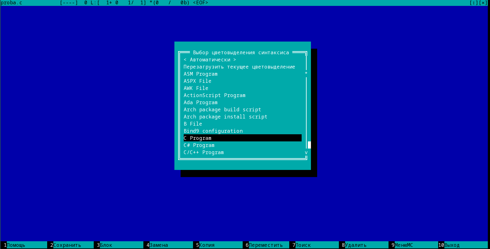{#fig:025 width=70% height=70%}

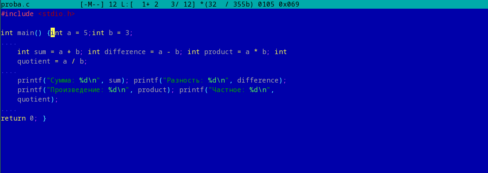{#fig:026 width=70% height=70%}

# Контрольные вопросы

1. Какие режимы работы есть в mc. Охарактеризуйте их.

Панели могут дополнительно быть переведены в один из двух режимов: Информация или Дерево. В режиме Информация на панель выводятся сведения о файле и текущей файловой системе, расположенных на активной панели. В режиме Дерево на одной из панелей выводится структура дерева каталогов.

2. Какие операции с файлами можно выполнить как с помощью команд shell, так и с помощью меню (комбинаций клавиш) mc? Приведите несколько примеров.

В разделе Командная строка оболочки (Shell) перечисляются команды и комбинации клавиш, которые используются для ввода и редактирования команд в командной строке оболочки. Большая часть этих команд служит для переноса имен файлов и/или имен каталогов в командную строку (чтобы уменьшить трудоемкость ввода) или для доступа к истории команд. Клавиши редактирования строк ввода используются как при редактировании командной строки, так и других строк ввода, появляющихся в различных запросах программы. Как с помощью меню так и с помощью команд shell можно переносить, копировать и получать информацию о файоах и каталогах.

3. Опишите структура меню левой (или правой) панели mc, дайте характеристику командам.

- стандартный — выводит список файлов и каталогов с указанием размера и времени правки;

- ускоренный — позволяет задать число столбцов, на которые разбивается панель при выводе списка имён файлов или каталогов без дополнительной информации;

- расширенный — помимо названия файла или каталога выводит сведения о правах доступа, владельце, группе, размере, времени правки;

- определённый пользователем — позволяет вывести те сведения о файле или каталоге, которые задаст сам пользователь.

Каждый из фарматов может быть отдельно установлен для каждой части (левой правой).

4. Опишите структура меню "Файл" mc, дайте характеристику командам.

Команды меню Файл: Просмотр ( F3 ) — позволяет посмотреть содержимое текущего (или выделенного) файла без возможности редактирования. - Просмотр вывода команды ( М + ! ) — функция запроса команды с параметрами (аргумент к текущему выбранному файлу). Правка ( F4 ) — открывает текущий (или выделенный) файл для его редактирования. Копирование ( F5 ) — осуществляет копирование одного или нескольких файлов или каталогов в указанное пользова телем во всплывающем окне место. Права доступа ( Ctrl-xc ) — позволяет указать (изменить) права доступа к одному или нескольким файлам или каталогам . Жёсткая ссылка ( Ctrl-xl ) — позволяет создать жёсткую ссылку к текущему (или выделенному) файлу. Символическая ссылка ( Ctrl-x s ) — позволяет создать символическую ссылку к текущему (или выделенному) файлу. Владелец/группа ( Ctrl-x o ) — позволяет задать (изменить) владельца и имя группы для одного или нескольких файлов или каталогов. Права (расширенные) — позволяет изменить права доступа и владения для одного или нескольких файлов или каталогов. Переименование ( F6 ) — позволяет переименовать (или переместить) один или несколько файлов или каталогов. Создание каталога ( F7 ) — позволяет создать каталог. Удалить ( F8 ) — позволяет удалить один или несколько файлов или каталогов. Выход ( F10 ) — завершает работу mc.

5. Опишите структура меню "Команда" mc, дайте характеристику командам.

- Дерево каталогов — отображает структуру каталогов системы;

- Поиск файла — выполняет поиск файлов по заданным параметрам;

- Переставить панели — меняет местами левую и правую панели;

- Сравнить каталоги (Ctrl-xd ) — сравнивает содержимое двух каталогов;

- Размеры каталогов — отображает размер и время изменения каталога (по умолчанию в mc размер каталога корректно не отображается);

- История командной строки — выводит на экран список ранее выполненных в оболочке команд;

- Каталоги быстрого доступа (Ctrl- )— при вызове выполняется быстрая смена текущего каталога на один из заданного списка;

- Восстановление файлов — позволяет восстановить файлы на файловых системах ext2 и ext3;

- Редактировать файл расширений — позволяет задать с помощью определённого синтаксиса действия при запуске файлов с определённым расширением (например, какое программного обеспечение запускать для открытия или редактирования файлов с расширением doc или docx);

- Редактировать файл меню — позволяет отредактировать контекстное меню пользователя, вызываемое по клавише F2;

- Редактировать файл расцветки имён — позволяет подобрать оптимальную для пользователя расцветку имён файлов в зависимости от их типа.

6. Опишите структура меню "Настройки" mc, дайте характеристику командам.

Меню Настройки содержит ряд дополнительных опций по внешнему виду и функциональности mc.

- Конфигурация — позволяет скорректировать настройки работы с панелями.

- Внешний вид и Настройки панелей — определяет элементы (строка меню, командная строка, подсказки и прочее), отображаемые при вызове mc, а также геометрию расположения панелей и цветовыделение.

- Биты символов — задаёт формат обработки информации локальным терминалом.

- Подтверждение — позволяет установить или убрать вывод окна с запросом подтверждения действий при операциях удаления и перезаписи файлов, а также при выходе из программы.

- Распознание клавиш - диалоговое окно используется для тестирования функциональных клавиш, клавиш управления курсором и прочее.

- Виртуальные ФС – настройки виртуальной файловой системы: тайм-аут, пароль и прочее.

7. Назовите и дайте характеристику встроенным командам mc.

- F1 Вызов контекстно-зависимой подсказки;

- F2 Вызов пользовательского меню с возможностью создания и/или дополнения дополнительных функций;

- F3 Просмотр содержимого файла, на который указывает подсветка в активной панели (без возможности редактирования);

- F4 Вызов встроенного в mc редактора для изменения содержания файла, на который указывает подсветка в активной панели;

- F5 Копирование одного или нескольких файлов, отмеченных в первой (активной) панели, в каталог, отображаемый на второй панели;

- F6 Перенос одного или нескольких файлов, отмеченных в первой (активной) панели, в каталог, отображаемый на второй панели;

- F7 Создание подкаталога в каталоге, отображаемом в активной панели;

- F8 Удаление одного или нескольких файлов (каталогов), отмеченных в первой (активной) панели файлов;

- F9 Вызов меню mc;

- F10 Выход из mc;

8. Назовите и дайте характеристику командам встроенного редактора mc.

- Ctrl-y удалить строку;

- Ctrl-u отмена последней операции;

- Ins вставка/замена;

- F7 поиск (можно использовать регулярные выражения);

- F7 повтор последней операции поиска;

- F4 замена;

- F3 первое нажатие — начало выделения, второе — окончание выделения;

- F5 копировать выделенный фрагмент;

- F6 переместить выделенный фрагмент;

- F8 удалить выделенный фрагмент;

- F2 записать изменения в файл;

- F10 выйти из редактора;

9. Дайте характеристику средствам mc, которые позволяют создавать меню, определяемые пользователем.

Можете сохранить часто используемые команды панелизации под отдельными информативными именами, чтобы иметь возможность их быстро вызвать по этим именам. Для этого нужно набрать команду в строке ввода (строка “Команда”) и нажать кнопку Добавить. После этого потребуется ввести имя, по которому мы будем вызывать команду. В следующий раз вам достаточно будет выбрать нужное имя из списка, а не вводить всю команду заново.

10. Дайте характеристику средствам mc, которые позволяют выполнять действия, определяемые пользователем, над текущим файлом.

Панель в mc отображает список файлов текущего каталога. Абсолютный путь к этому каталогу отображается в заголовке панели. У активной панели заголовок и одна из её строк подсвечиваются. Управление панелями осуществляется с помощью определённых комбинаций клавиш или пунктов меню mc.

# Выводы

В ходе выполнения лабораторной работы были изучены и освоены базовые навыки по работе с командной обалочкой mc.

# Список литературы {.unnumbered}

1. [Лабораторная работа №7](https://esystem.rudn.ru/mod/resource/view.php?id=970830)
2. [Русский мануал по mc](https://manpages.ubuntu.com/manpages/xenial/ru/man1/mc.1.html#ключи)
3. [Шпаргалка по горячим клавишам mc](https://prosto-tak.ru/shpargalka-po-mc-midnight-commander/)
4. [Дополнительно информация](https://www.linux.org.ru/forum/admin/16761436)
