---
## Front matter
lang: ru-RU
title: "Лабораторная работа №8: Презентация."
subtitle: 
  Текстовой редактор vi.
author: 
    Евдокимов Максим Михайлович. Группа - НФИбд-01-20.\inst{1}
institute: 
    \inst{1}Российский Университет Дружбы Народов

date: 27 декабря, 2023, Москва, Россия

## i18n babel
babel-lang: russian
babel-otherlangs: english

## Formatting pdf
toc: false
toc-title: Содержание
slide_level: 2
aspectratio: 169
section-titles: true
theme: metropolis
header-includes:
 - \metroset{progressbar=frametitle,sectionpage=progressbar,numbering=fraction}
 - '\makeatletter'
 - '\beamer@ignorenonframefalse'
 - '\makeatother'
---

# Цели и задачи работы

## Цель лабораторной работы

Познакомиться с операционной системой Linux. Получить практические навыки работы с редактором vi, установленным по умолчанию практически во всех дистрибутивах.

## Задание

1. Ознакомиться с теоретическим материалом.
2. Ознакомиться с редактором vi.
3. Выполнить упражнения, используя команды vi.

# Указание к работе

## Описание метода

В большинстве дистрибутивов Linux в качестве текстового редактора по умолчанию устанавливается интерактивный экранный редактор vi (Visual display editor).
Редактор vi имеет три режима работы:

– командный режим — предназначен для ввода команд редактирования и навигации по редактируемому файлу;

– режим вставки — предназначен для ввода содержания редактируемого файла;

– режим последней (или командной) строки — используется для записи изменений в файл и выхода из редактора.

---

Для вызова редактора vi необходимо указать команду vi и имя редактируемого файла: vi <имя_файла>. При этом в случае отсутствия файла с указанным именем будет создан такой файл. Переход в командный режим осуществляется нажатием клавиши Esc . Для выхода из редактора vi необходимо перейти в режим последней строки: находясь в командном режиме, нажать Shift-; (по сути символ : — двоеточие), затем:

– набрать символы wq, если перед выходом из редактора требуется записать изменения в файл;

– набрать символ q (или q!), если требуется выйти из редактора без сохранения.

# Процесс выполнения лабораторной работы

## ЧАСТЬ 1

1. Создайте каталог с именем ~/work/os/lab06 (изменён на lab08):

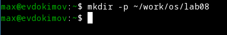{#fig:001 width=70% height=70%}

---

2. Перейдите во вновь созданный каталог:

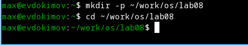{#fig:002 width=70% height=70%}

---

3. Вызовите vi и создайте файл hello.sh командой "vi hello.sh":

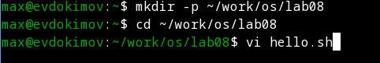{#fig:003 width=70% height=70%}

---

4. Нажмите клавишу "i" и вводите следующий текст (указанный в добораторной):

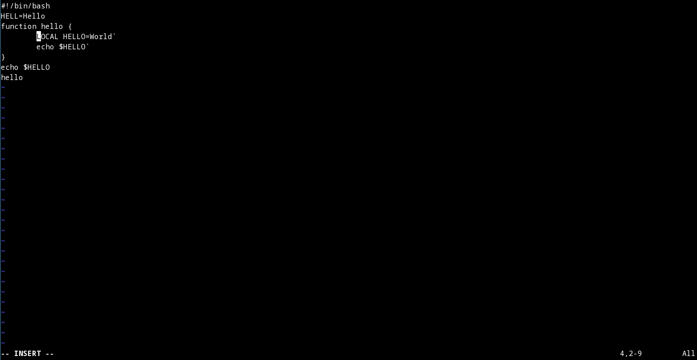{#fig:004 width=70% height=70%}

---

5. Нажмите клавишу "Esc" для перехода в командный режим после завершения ввода текста.

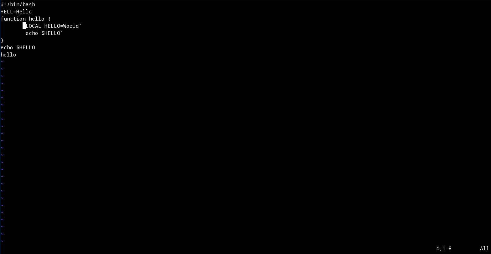{#fig:005 width=70% height=70%}

---

6. Нажмите ":" для перехода в режим последней строки и внизу вашего экрана появится приглашение в виде двоеточия.

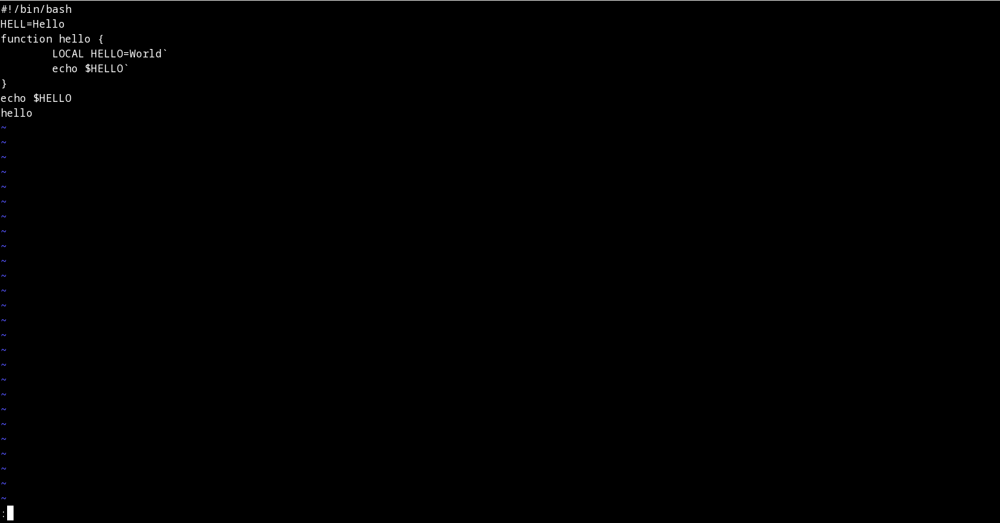{#fig:006 width=70% height=70%}

---

7. Нажмите "w" (записать) и "q" (выйти), а затем нажмите клавишу Enter для сохранения вашего текста и завершения работы.

{#fig:007 width=70% height=70%}

---

8. Сделайте файл исполняемым командой "chmod +x hello.sh":

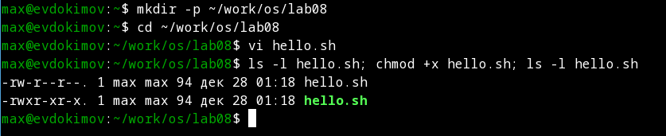{#fig:008 width=70% height=70%}

---

## ЧАСТЬ 2

1. Вызовите vi на редактирование файла "vi ~/work/os/lab08/hello.sh":

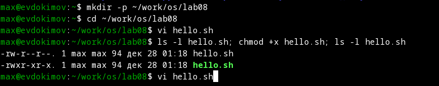{#fig:009 width=70% height=70%}

---

2. Установите курсор в конец слова HELL второй строки:

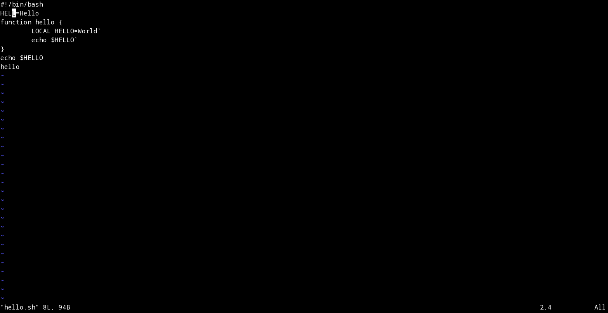{#fig:010 width=70% height=70%}

---

3. Перейдите в режим вставки и замените на HELLO режимом "a". Нажмите "Esc" для возврата в командный режим:

{#fig:011 width=70% height=70%}

---

4. Установите курсор на четвертую строку и сотрите слово LOCAL, "dw" или посимвольно "x":

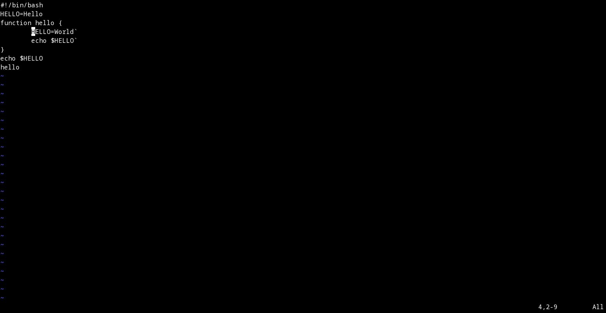{#fig:012 width=70% height=70%}

---

5. Перейдите в режим вставки и наберите следующий текст: local, нажмите "Esc" для возврата в командный режим:

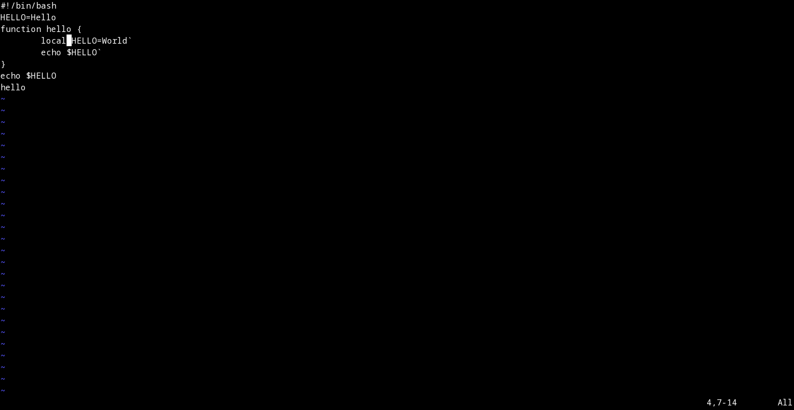{#fig:013 width=70% height=70%}

---

6. Установите курсор на последней строке файла. Вставьте после неё строку ("p" -> echo $HELLO), содержащую следующий текст ("Y" <- echo $HELLO): echo $HELLO:

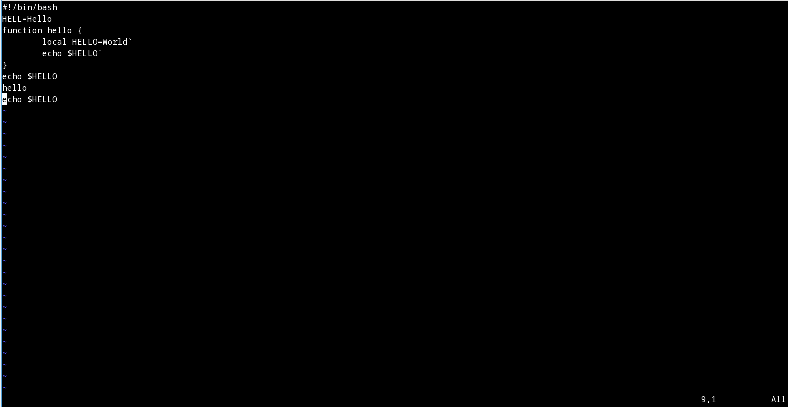{#fig:014 width=70% height=70%}

---

7. Нажмите Esc для перехода в командный режим:

8. Удалите последнюю строку (":9d" или ":9,10d"):

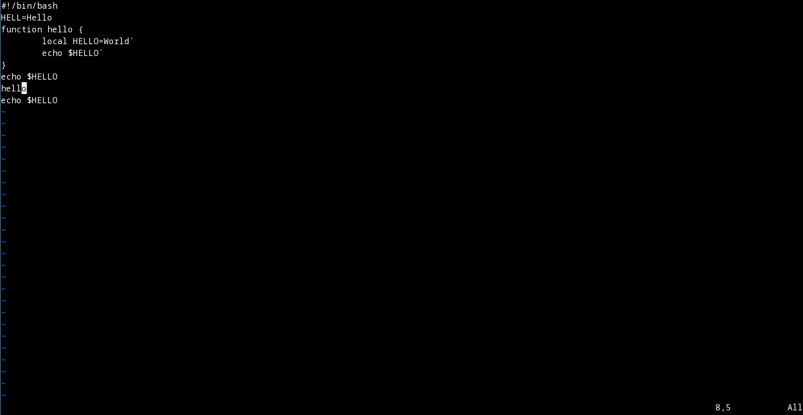{#fig:016 width=70% height=70%}

---

9. Введите команду отмены изменений "u" для отмены последней команды:

{#fig:017 width=70% height=70%}

---

10. Введите символ ":" для перехода в режим последней строки. Запишите произведённые изменения и выйдите (":wq") из vi:

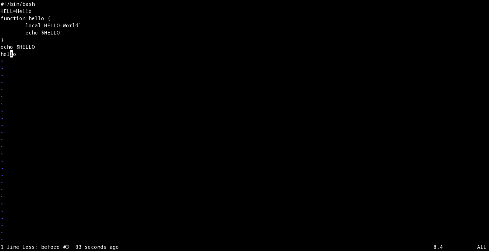{#fig:017 width=70% height=70%}

# Контрольные вопросы

1. Дайте краткую характеристику режимам работы редактора vi.

- командный режим — предназначен для ввода команд редактирования и навигации по редактируемому файлу;

- режим вставки — предназначен для ввода содержания редактируемого файла;

- режим последней (или командной) строки — используется для записи изменений в файл и выхода из редактора.

---

2. Как выйти из редактора, не сохраняя произведённые изменения?

Можно нажимать символ q (или q!), если требуется выйти из редактора без сохранения.

---

3. Назовите и дайте краткую характеристику командам позиционирования.

- 0 (ноль) — переход в начало строки;

- $ — переход в конец строки;

- G — переход в конец файла;

- n G — переход на строку с номером n.

---

4. Что для редактора vi является словом?

Редактор vi предполагает, что слово - это строка символов, которая может включать в себя буквы, цифры и символы подчеркивания.

---

5. Каким образом из любого места редактируемого файла перейти в начало (конец) файла?

С помощью G — переход в конец файла и для перехода на первый можно 0G.

---

6. Назовите и дайте краткую характеристику основным группам команд редактирования.

- Вставка текста "а" — вставить текст после курсора; "А" — вставить текст в конец строки; "i" — вставить текст перед курсором; "ni" — вставить текст n раз; "I" — вставить текст в начало строки.

- Вставка строки "о" — вставить строку под курсором; "О" — вставить строку над курсором.

---

- Удаление текста "x" — удалить один символ в буфер; "dw" — удалить одно слово в буфер; "d$" — удалить в буфер текст от курсора до конца строки; "d0" — удалить в буфер текст от начала строки до позиции курсора; "dd" — удалить в буфер одну строку; "ndd" — удалить в буфер n строк.

- Отмена и повтор произведённых изменений "u" — отменить последнее изменение; "." — повторить последнее изменение.

- Копирование текста в буфер "Y" — скопировать строку в буфер; "nY" — скопировать n строк в буфер; "yw" — скопировать слово в буфер.

---

- Вставка текста из буфера "p" — вставить текст из буфера после курсора; "P" — вставить текст из буфера перед курсором.

- Замена текста "cw" — заменить слово; "ncw" — заменить n слов; "c$" — заменить текст от курсора до конца строки; "r" — заменить слово; "R" — заменить текст.

- Поиск текста "/ текст" — произвести поиск вперёд по тексту указанной строки символов текст; "? текст" — произвести поиск назад по тексту указанной строки символов текст.

---

7. Необходимо заполнить строку символами $. Каковы ваши действия?

Перейти в режим вставки и вставить его хоть в ручную.

---

8. Как отменить некорректное действие, связанное с процессом редактирования?

С помощью "u" — отменить последнее изменение. И так можно несколько раз.

---

9. Назовите и дайте характеристику основным группам команд режима последней строки.

Режим последней строки — используется для записи изменений в файл и выхода из редактора.

---

10. Как определить, не перемещая курсора, позицию, в которой заканчивается строка?

"$" — переход в конец строки.

---

11. Выполните анализ опций редактора vi (сколько их, как узнать их назначение и т.д.).

Опции редактора vi позволяют настроить рабочую среду. Для задания опций используется команда "set" (в режиме последней строки): ": set all" — вывести полный список опций; ": set nu" — вывести номера строк; ": set list" — вывести невидимые символы; ": set ic" — не учитывать при поиске, является ли символ прописным или строчным.

---

12. Как определить режим работы редактора vi?

В редакторе vi есть два основных режима: командный режим и режим вставки. По умолчанию работа начинается в командном режиме. В режиме вставки клавиатура используется для набора текста. Для выхода в командный режим используется клавиша "Esc" или комбинация "Ctrl + c".

---

13. Постройте граф взаимосвязи режимов работы редактора vi.

- Режим команд (Command mode): По умолчанию, когда вы открываете vi, вы находитесь в режиме команд. В этом режиме вы можете выполнять команды, такие как перемещение по тексту, удаление строк, сохранение файла и другие операции.

- Режим вставки (Insert mode): В режиме вставки вы можете вводить текст непосредственно в файл. Чтобы перейти в режим вставки, нажмите клавишу "i" в режиме команд.

---

- Режим замены (Replace mode): В режиме замены вы можете заменить существующий текст новым текстом. Чтобы перейти в режим замены, нажмите клавишу "R" в режиме команд.

- Режим визуального выделения (Visual mode): В режиме визуального выделения вы можете выделять текст для выполнения операций над ним, таких как копирование, удаление или замена. Чтобы перейти в режим визуального выделения, нажмите клавишу "v" в режиме команд.

---

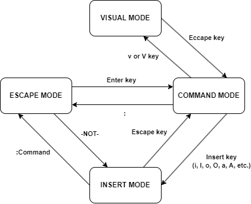{#fig:018 width=70% height=70%}

# Выводы по проделанной работе

## Вывод

В ходе выполнения лабораторной работы были изучены основные способы работы и управлния текстовым редактором vi.
