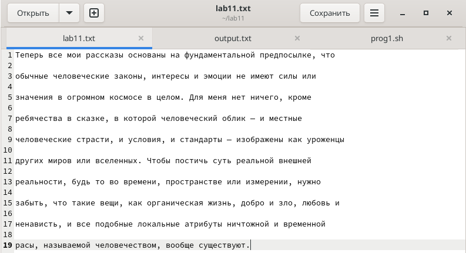
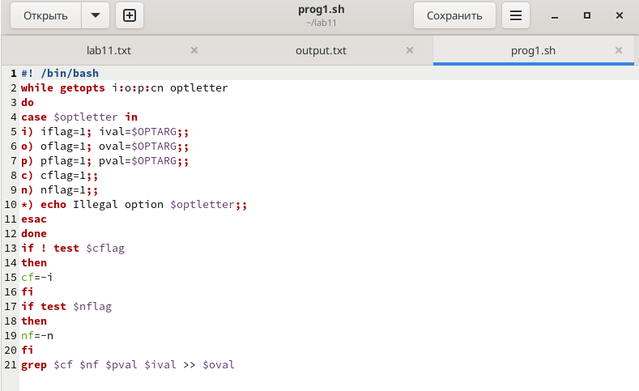
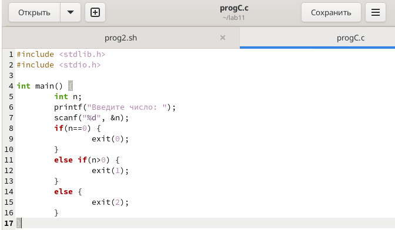
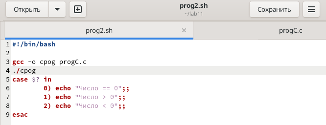
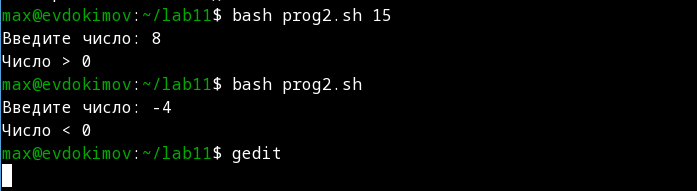
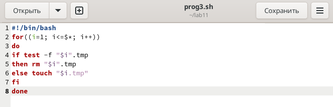
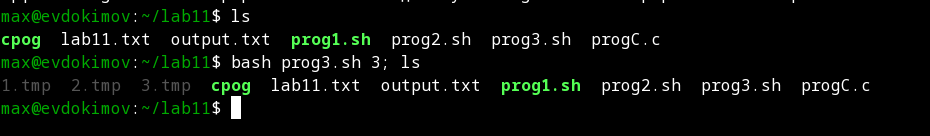
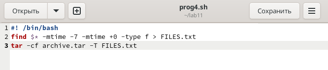
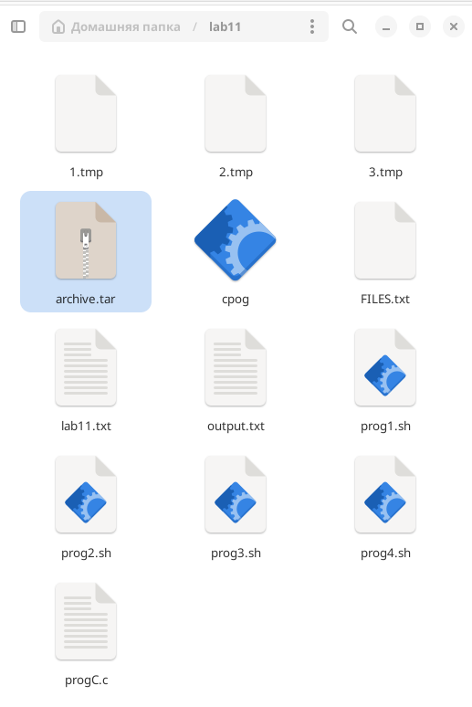

---
## Front matter
lang: ru-RU
title: "Лабораторная работа №11: отчет."
subtitle: "Программирование в командном процессоре ОС UNIX. Ветвления и циклы."
author: "Евдокимов Максим Михайлович. Группа - НФИбд-01-20."

## Generic otions
lang: ru-RU
toc-title: "Содержание"

## Bibliography
bibliography: bib/cite.bib
csl: pandoc/csl/gost-r-7-0-5-2008-numeric.csl

## Pdf output format
toc: true # Table of contents
toc-depth: 2
lof: true # List of figures
fontsize: 12pt
linestretch: 1.5
papersize: a4
documentclass: scrreprt
## I18n polyglossia
polyglossia-lang:
  name: russian
  options:
	- spelling=modern
	- babelshorthands=true
polyglossia-otherlangs:
  name: english
## I18n babel
babel-lang: russian
babel-otherlangs: english
## Fonts
mainfont: PT Serif
romanfont: PT Serif
sansfont: PT Sans
monofont: PT Mono
mainfontoptions: Ligatures=TeX
romanfontoptions: Ligatures=TeX
sansfontoptions: Ligatures=TeX,Scale=MatchLowercase
monofontoptions: Scale=MatchLowercase,Scale=0.9
## Biblatex
biblatex: true
biblio-style: "gost-numeric"
biblatexoptions:
  - parentracker=true
  - backend=biber
  - hyperref=auto
  - language=auto
  - autolang=other*
  - citestyle=gost-numeric
## Pandoc-crossref LaTeX customization
figureTitle: "Рис."
listingTitle: "Листинг"
lofTitle: "Список иллюстраций"
lotTitle: "Список таблиц"
lolTitle: "Листинги"
## Misc options
indent: true
header-includes:
  - \usepackage{indentfirst}
  - \usepackage{float} # keep figures where there are in the text
  - \floatplacement{figure}{H} # keep figures where there are in the text
---

# Цель работы

Изучить основы программирования в оболочке ОС UNIX. Научится писать более сложные командные файлы с использованием логических управляющих конструкций и циклов.

# Задание

1. Изучение правила написания циклов.
2. Изучить правила написание ветвление.

# Выполнение лабораторной работы

## Задание 1

1. Используя команды getopts grep, написать командный файл, который анализирует командную строку с ключами:

- -iinputfile — прочитать данные из указанного файла;
- -ooutputfile — вывести данные в указанный файл;
- -pшаблон — указать шаблон для поиска;
- -C — различать большие и малые буквы;
- -n — выдавать номера строк.

а затем ищет в указанном файле нужные строки, определяемые ключом -p.

{#fig:001 width=70% height=70%}

{#fig:002 width=70% height=70%}

{#fig:003 width=70% height=70%}

## Код 1

``` bash
#! /bin/bash
while getopts i:o:p:cn optletter
do
case $optletter in
i) iflag=1; ival=$OPTARG;;
o) oflag=1; oval=$OPTARG;;
p) pflag=1; pval=$OPTARG;;
c) cflag=1;;
n) nflag=1;;
*) echo Illegal option $optletter;;
esac
done
if ! test $cflag
then
cf=-i
fi
if test $nflag
then
nf=-n
fi
grep $cf $nf $pval $ival >> $oval
```

## Задание 2

2. Написать на языке Си программу, которая вводит число и определяет, является ли оно больше нуля, меньше нуля или равно нулю. Затем программа завершается с помощью функции exit(n), передавая информацию в о коде завершения в оболочку. Командный файл должен вызывать эту программу и, проанализировав с помощью команды $?, выдать сообщение о том, какое число было введено.

{#fig:004 width=70% height=70%}

{#fig:005 width=70% height=70%}

{#fig:006 width=70% height=70%}

## Код 2

``` bash
gcc -o cpog progC.c
./cprog
case $? in
	0) echo "Число == 0";;
	1) echo "Число > 0";;
	2) echo "Число < 0";;
esac
```

``` C
#include <stdlib.h>
#include <stdio.h>

int main() {
	int n;
	printf("Введите число: ");
	scanf("%d", &n);
	if(n==0) {
		exit(0);
	}
	else if(n>0) {
		exit(1);
	}
	else {
		exit(2);
	}
}
```

## Задание 3

3. Написать командный файл, создающий указанное число файлов, пронумерованных последовательно от 1 до 𝑁 (например 1.tmp, 2.tmp, 3.tmp,4.tmp и т.д.). Число файлов, которые необходимо создать, передаётся в аргументы командной строки. Этот же командный файл должен уметь удалять все созданные им файлы (если они существуют).

{#fig:007 width=70% height=70%}

{#fig:008 width=70% height=70%}

## Код 3

``` bash
#!/bin/bash
for((i=1; i<=$*; i++))
do
if test -f "$i".tmp
then rm "$i".tmp
else touch "$i.tmp"
fi
done
```

## Задание 4

4. Написать командный файл, который с помощью команды tar запаковывает в архив все файлы в указанной директории. Модифицировать его так, чтобы запаковывались только те файлы, которые были изменены менее недели тому назад (использовать команду find).

{#fig:009 width=70% height=70%}

{#fig:010 width=70% height=70%}

## Код 4

``` bash
#! /bin/bash
find $* -mtime -7 -mtime +0 -type f > FILES.txt
tar -cf archive.tar -T FILES.txt
```

# Контрольные вопросы

1. Каково предназначение команды getopts?

Осуществляет синтаксический анализ командной строки, выделяя флаги, и иcпользуется для объявления переменных. Синтаксис команды следующий: getopts option-string variable [arg … ] Флаги – это опции командной строки, обычно помеченные знаком минус; Например, -F является флагом для команды ls -F. Иногда эти флаги имеют аргументы, связанные с ними. Программы интерпретируют эти флаги, соответствующим образом изменяя свое поведение. Строка опций option-string — это список возможных букв и чисел соответствующего флага. Если ожидается, что некоторый флаг будет сопровождаться некоторым аргументом, то за этой буквой должно следовать двоеточие.

2. Какое отношение метасимволы имеют к генерации имён файлов?

При перечислении имён файлов текущего каталога можно использовать следующие символы: − соответствует произвольной, в том числе и пустой строке; "?" − соответствует любому одинарному символу; "[c1-c2]" − соответствует любому символу, лексикографически находящемуся между символами с1 и с2. Например, "echo *" выведет имена всех файлов текущего каталога, что представляет собой простейший аналог команды ls; "ls .c" − выведет все файлы с последними двумя символами, совпадающими с ".c". "echo prog.?" − выведет все файлы, состоящие из пяти или шести символов, первыми пятью символами которых являются prog. "[a-z]" − соответствует произвольному имени файла в текущем каталоге, начинающемуся с любой строчной буквы латинского алфавита.

3. Какие операторы управления действиями вы знаете?

Часто бывает необходимо обеспечить проведение каких-либо действий циклически и управление дальнейшими действиями в зависимости отрезультатов проверки некоторого условия. Для решения подобных задач язык программирования bash предоставляет возможность использовать такие управляющие конструкции, как for, case, if и while. С точки зрения командного процессора эти управляю- щие конструкции являются обычными командами и могут использоваться как при создании командных файлов, так и при работе в интерактивном режиме. Команды, реализующие подобные конструкции, по сути, являются операторами языка программирования bash. Поэтому при описании языка программирова- ния bash термин оператор будет использоваться наравне с термином команда.

4. Какие операторы используются для прерывания цикла?

Два несложных способа позволяют вам прерывать циклы в оболочке bash. Команда break завершает выполнение цикла, а команда continue завершает данную итерацию блока операторов. Команда break полезна для завершения цикла while в ситуациях, когда условие перестаёт быть правильным. Команда continue исполь- зуется в ситуациях, когда больше нет необходимости выполнять блок операторов, но вы можете захотеть продолжить проверять данный блок на других условных выражениях.

5. Для чего нужны команды false и true?

Следующие две команды ОС UNIX используются только совместно с управляющими конструкциями языка программирования bash: это команда true, которая всегда возвращает код завершения, == 0 (истина), и команда false, которая всегда возвращает код завершения, != 0 (ложь).

6. Что означает строка if test -f man$s/$i.$s, встреченная в командном файле?

Строка "if test -f man$s/$i.$s" проверяет является ли этот "объект" обычным файлом, если же данный файл является каталогом, то команда вернет нулевое значение (ложь).

7. Объясните различия между конструкциями while и until.

Выполнение оператора цикла while сводится к тому, что сначала выполняется последовательность команд (операторов), которую задаёт "список-команд" в строке, содержащей служебное слово while, а затем, если последняя выполненная команда из этой последовательности возвращает нулевой код завершения цикл (истина), выполняется последовательность команд (операторов), которую задаёт список-команд в строке, содержащей служебное слово do, после чего осуществляется безусловный переход на начало оператора цикла while. Выход из цикла будет осуществлён тогда, когда сделуя всей цепочке команд возвратит ненулевой код завершения (ложь). При замене в операторе цикла while служебного слова while на until условие, при выполнении которого осуществляется выход из цикла, меняется на противоположное. В остальном оператор цикла while и оператор цикла until идентичны.

# Выводы

В ходе выполнения лабораторной работы были изучены способы создания ветвления и циклов и работа с си файлами.

# Список литературы {.unnumbered}

1. [Лабораторная работа №11](https://esystem.rudn.ru/mod/resource/view.php?id=970838)
