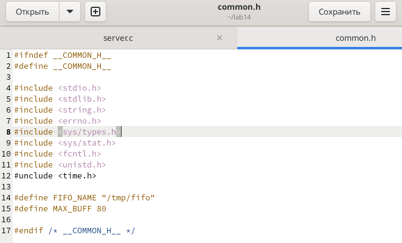

---
## Front matter
lang: ru-RU
title: "Лабораторная работа №14: Презентация."
subtitle: 
  Именованные каналы.
author: 
    Евдокимов Максим Михайлович. Группа - НФИбд-01-20.\inst{1}
institute: 
    \inst{1}Российский Университет Дружбы Народов

date: 28 декабря, 2023, Москва, Россия

## i18n babel
babel-lang: russian
babel-otherlangs: english

## Formatting pdf
toc: false
toc-title: Содержание
slide_level: 2
aspectratio: 169
section-titles: true
theme: metropolis
header-includes:
 - \metroset{progressbar=frametitle,sectionpage=progressbar,numbering=fraction}
 - '\makeatletter'
 - '\beamer@ignorenonframefalse'
 - '\makeatother'
---

# Цели и задачи работы

## Цель лабораторной работы

Приобретение практических навыков работы с именованными каналами.

## Задание

1. Научится создовать локальные сервера.
2. Научится создовать клиентов (ботов).
3. Изучить понятия именованные каналы, сигналы.

# Указание к работе

## Описание метода

Одним из видов взаимодействия между процессами в операционных системах является обмен сообщениями. Под сообщением понимается последовательность байтов, передаваемая от одного процесса другому. В операционных системах типа UNIX есть 3 вида межпроцессорных взаимодействий: общеюниксные (именованные каналы, сигналы), System V Interface Definition (SVID — разделяемая память, очередь сообщений, семафоры) и BSD (сокеты). Для передачи данных между неродственными процессами можно использовать механизм именованных каналов (named pipes). Данные передаются по принципу FIFO (First In First Out) (первым записан — первым прочитан), поэтому они называются также FIFO pipes или просто FIFO. Именованные каналы отличаются от неименованных наличием идентификатора канала, который представлен как специальный файл (соответственно имя именованного канала — это имя файла). Поскольку файл находится на локальной файловой системе, данное IPC используется внутри одной системы.

# Выполнение лабораторной работы

## Условие задания

Изучите приведённые в тексте программы server.c и client.c. Взяв данные примеры
за образец, напишите аналогичные программы, внеся следующие изменения:

{#fig:001 width=70% height=70%}

---

1. Работает не 1 клиент, а несколько (например, два).

{#fig:002 width=70% height=70%}

---

{#fig:003 width=70% height=70%}

---

{#fig:004 width=70% height=70%}

---

2. Клиенты передают текущее время с некоторой периодичностью (например, раз в пять секунд). Используйте функцию sleep() для приостановки работы клиента.

{#fig:005 width=70% height=70%}

---

{#fig:006 width=70% height=70%}

---

3. Сервер работает не бесконечно, а прекращает работу через некоторое время (например, 30 сек). Используйте функцию clock() для определения времени работы сервера. Что будет в случае, если сервер завершит работу, не закрыв канал?

{#fig:007 width=70% height=70%}

---

## Код

client.c:

``` C
#include "common.h"
#define MESSAGE "Hello Server!!!\n"

int main()
{
int writefd;
int msglen;

printf("FIFO Client...\n");
```

---

``` C
for (int i=0; i<4; i++)
{
if((writefd = open(FIFO_NAME, O_WRONLY)) < 0)
{
fprintf(stderr, "%s: Невозможно открыть FIFO (%s)\n", __FILE__, strerror(errno));
exit(-1);
break;
}
```

---

``` C
long int ttime=time(NULL);
char *text=ctime(&ttime);
msglen = strlen(MESSAGE);
if(write(writefd, MESSAGE, msglen) != msglen)
{
fprintf(stderr, "%s: Ошибка записи в FIFO (%s)\n", __FILE__, strerror(errno));
exit(-2);
}
sleep(5);
}

close(writefd);
exit(0);
}
```

---

common.h:

``` C
#ifndef __COMMON_H__
#define __COMMON_H__

#include <stdio.h>
#include <stdlib.h>
#include <string.h>
#include <errno.h>
#include <sys/types.h>
#include <sys/stat.h>
#include <fcntl.h>
#include <unistd.h>
#include <time.h>

#define FIFO_NAME "/tmp/fifo"
#define MAX_BUFF 80

#endif /* __COMMON_H__ */
```

---

server.c:

``` C
#include "common.h"

int main()
{
int readfd;
int n;
char buff[MAX_BUFF];
printf("FIFO Server...\n");
```

---

``` C
if(mknod(FIFO_NAME, S_IFIFO | 0666, 0) < 0)
{
fprintf(stderr, "%s: Невозможно создать FIFO (%s)\n",
__FILE__, strerror(errno));
exit(-1);
}

if((readfd = open(FIFO_NAME, O_RDONLY)) < 0)
{
fprintf(stderr, "%s: Невозможно открыть FIFO (%s)\n",
__FILE__, strerror(errno));
exit(-2);
}
```

---

``` C
clock_t start=time(NULL);
while(time(NULL)-start<30)
{
while((n = read(readfd, buff, MAX_BUFF)) > 0)
{
if(write(1, buff, n) != n)
{
fprintf(stderr, "%s: Ошибка вывода (%s)\n",
__FILE__, strerror(errno));
}
}
exit(-3);
}
```

---

``` C
close(readfd);
if(unlink(FIFO_NAME) < 0)
{
fprintf(stderr, "%s: Невозможно удалить FIFO (%s)\n",
__FILE__, strerror(errno));
exit(-4);
}

exit(0);
}
```

---

Makefile:

``` Makefile
all: server client

server: server.c common.h
	gcc server.c -o server

client: client.c common.h
	gcc client.c -o client

clean:
	-rm server client *.o
```

# Контрольные вопросы

1. В чем ключевое отличие именованных каналов от неименованных?

Именованные каналы отличаются от неименованных наличием идентификатора канала, который представлен как специальный файл (соответственно имя именованного канала − это имя файла). Поскольку файл находится на локальной файловой системе, данное IPC используется внутри одной системы.

---

2. Возможно ли создание неименованного канала из командной строки?

Чтобы создать неименованный канал из командной строкинужно использовать символ |, служащий для объединения двух и более процессов: process_1 | process_2 | process_3 | и так далее.

---

3. Возможно ли создание именованного канала из командной строки?

Чтобы создать именованный канал из командной строкинужно использовать либо команду «mknod», либо команду «mkfifo».

---

4. Опишите функцию языка С, создающую неименованный канал.

Неименованный канал является средством взаимодействия между связанными процессами −родительским и дочерним. Родительский процесс создает канал при помощи системного вызова: «int pipe(int fd[2]);». Массив из двух целых чисел является выходным параметром этого системного вызова. Если вызов выполнился нормально, то этот массив содержит два файловых дескриптора. fd[0] является дескриптором для чтения из канала, fd[1] −дескриптором для записи в канал. Когда процесс порождает другой процесс, дескрипторы родительского процесса наследуются дочерним процессом, и, таким образом, прокладывается трубопровод между двумя процессами. Естественно, что один из процессов использует канал только для чтения, а другой −только для записи. Поэтому, если, например, через канал должны передаваться данные из родительского процесса в дочерний, родительский процесс сразу после запуска дочернего процесса закрывает дескриптор канала для чтения, а дочерний процесс закрывает дескриптор для записи. Двунаправленный обмен просто подрузомевает 2 канала.

---

5. Опишите функцию языка С, создающую именованный канал.

«intmkfifo(constcharpathname, mode_tmode);», где первый параметр − путь, где будет располагаться FIFO (имя файла, идентифицирующего канал), второй параметр определяет режим работы с FIFO (маска прав доступа к файлу), «mknod (namefile, IFIFO | 0666, 0)», где namefile −имя канала, 0666 −к каналу разрешен доступ на запись и на чтение любому запросившему процессу), «int mknod(const char pathname, mode_t mode, dev_t dev);».Функцияmkfifo() создает канал и файл соответствующего типа. Если указанный файл канала уже существует, mkfifo() возвращает -1. После создания файла канала процессы, участвующие в обмене данными, должны открыть этот файл либо для записи, любо для чтения. 6). При чтении меньшего числа байтов, чем находится в канале или FIFO, возвращается требуемое число байтов, остаток сохраняется для последующих чтений.При чтении большего числа байтов, чем находится в канале или FIFO, возвращается доступное число байтов. Процесс, читающий из канала, должен соответствующим образом обработать ситуацию, когда прочитано меньше, чем заказано.

---

6. Что будет в случае прочтения из fifo меньшего числа байтов, чем находится в канале? Большего числа байтов?

Запись числа байтов, меньшего емкости канала или FIFO, гарантированно атомарно. Это означает, что в случае, когда несколько процессов одновременнозаписывают в канал, порции данных от этих процессов не перемешиваются.При записи большего числа байтов, чем это позволяет канал или FIFO, вызов write(2) блокируется до освобождения требуемого места. При этом атомарность операции не гарантируется. Если процесс пытается записать данные в канал, не открытый ни одним процессом на чтение, процессу генерируется сигнал SIGPIPE, а вызов write(2) возвращает 0 с установкой ошибки (errno=ERRPIPE) (если процесс не установил обработки сигнала SIGPIPE, производится обработка по умолчанию −процесс завершается).

---

7. Аналогично, что будет в случае записи в fifo меньшего числа байтов, чем позволяет буфер? Большего числа байтов?

Запись числа байтов, меньшего емкости канала или FIFO, гарантированно атомарно. Это означает, что в случае, когда несколько процессов одновременнозаписывают в канал, порции данных от этих процессов не перемешиваются.При записи большего числа байтов, чем это позволяет канал или FIFO, вызов write(2) блокируется до освобождения требуемого места. При этом атомарность операции не гарантируется. Если процесс пытается записать данные в канал, не открытый ни одним процессом на чтение, процессу генерируется сигнал SIGPIPE, а вызов write(2) возвращает 0 с установкой ошибки (errno=ERRPIPE) (если процесс не установил обработки сигнала SIGPIPE, производится обработка по умолчанию −процесс завершается).

---

8. Могут ли два и более процессов читать или записывать в канал?

Два и более процессов могут читать и записывать в канал.

---

9. Опишите функцию write (тип возвращаемого значения, аргументы и логику работы). Что означает 1 (единица) в вызове этой функции в программе server.c (строка 42)?

Функция write записывает байты count из буфера buffer вфайл, связанный с handle. Операции write начинаются с текущей позиции указателя на файл (указатель ассоциирован с заданным файлом). Если файл открыт для добавления, операции выполняются в конец файла. После осуществления операций записи указатель на файл(если он есть) увеличивается на количество действительно записанных байтов.Функция write возвращает число действительно записанных байтов. Возвращаемое значение должно быть положительным, но меньше числа count (например, когда размер для записи count байтоввыходит за пределы пространства на диске). Возвращаемое значение-1 указывает на ошибку; errno устанавливается в одно из следующихзначений:EACCES − файл открыт для чтения или закрыт для записи,EBADF− неверный handle-р файла,ENOSPC − на устройстве нет свободного места.Единица в вызове функции writeв программе server.cозначаетидентификатор (дескриптор потока) стандартного потока вывода.

---

10. Опишите функцию strerror.

Прототип функции strerror: «char * strerror( int errornum );». Функция strerror интерпретирует номер ошибки, передаваемый в функцию в качестве аргумента −errornum, в понятное для человека текстовое сообщение (строку). Откуда берутся эти ошибки? Ошибки эти возникают при вызове функций стандартных Сибиблиотек. То есть хорошим тоном программирования будет − использование этой функции в паре с другой, и если возникнет ошибка, то пользователь или программист поймет,как исправить ошибку, прочитав сообщение функции strerror. Возвращенный указатель ссылается на статическую строку с ошибкой, которая не должна быть изменена программой. Дальнейшие вызовы функции strerror перезапишут содержание этой строки. Интерпретированные сообщения об ошибках могут различаться, это зависит от платформы и компилятора.

# Выводы по проделанной работе

## Вывод

В ходе выполнения лабораторной работы были изучены и проработаны на практике именованные каналы.
